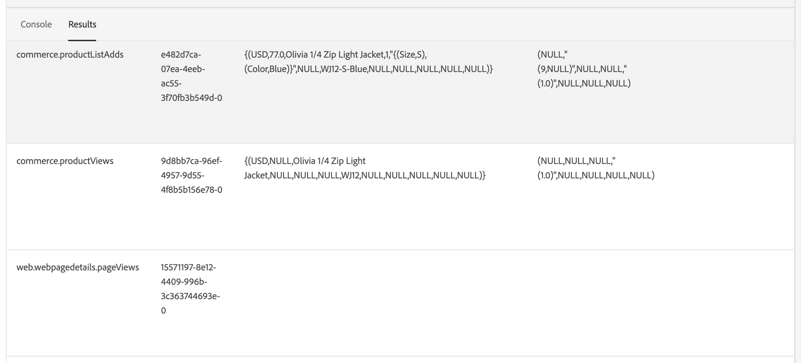

# Koppla handelsdata till Adobe Experience Platform

När du installerar [!DNL Data Connection] tillägg visas två nya konfigurationssidor i **System** meny under **Tjänster** i handeln _Administratör_.

- Commerce Services Connector
- [!DNL Data Connection]

Om du vill ansluta din Adobe Commerce-instans till Adobe Experience Platform måste du konfigurera båda anslutningarna, först med Commerce Services-kopplingen och sedan slutföra med [!DNL Data Connection] tillägg.

## Uppdatera Commerce Services-kopplingen

Om du tidigare har installerat en Adobe Commerce-tjänst har du förmodligen redan konfigurerat Commerce Services-kopplingen. Annars måste du utföra följande uppgifter på [Commerce Services-koppling](../landing/saas.md) sida:

1. Logga in på ditt Commerce-konto för att [hämta produktions- och sandbox-API-nycklar](../landing/saas.md#credentials).
1. Välj en [SaaS-datautrymme](../landing/saas.md#saas-configuration).
1. Logga in på ditt Adobe-konto för att [hämta ditt organisations-ID](../landing/saas.md#ims-organization-optional).

När du har konfigurerat Commerce Services-kopplingen konfigurerar du [!DNL Data Connection] tillägg.

## Uppdatera [!DNL Data Connection] extension

I det här avsnittet ansluter du din Adobe Commerce-instans till Adobe Experience Platform med ditt företags-ID. Du kan sedan ange vilken typ av data - butiker och bakkontor - som ska skickas till Experience Platform.

## Allmänt

1. Gå till Admin **System** > Tjänster > **[!DNL Data Connection]**.

1. På **Inställningar** flik under **Allmänt** verifierar du det ID som är kopplat till ditt Adobe Experience Platform-konto enligt konfigurationen i [Commerce Services Connector](../landing/saas.md#organizationid). Organisations-ID:t är globalt. Endast ett organisations-ID kan associeras per Adobe Commerce-instans.

1. I **Omfång** nedrullningsbar meny, ange kontexten som **Webbplats**.

1. (Valfritt) Om du redan har en [AEP Web SDK (legering)](https://experienceleague.adobe.com/docs/experience-platform/edge/home.html) aktivera kryssrutan och lägg till namnet på din AEP Web SDK. Annars lämnar du dessa fält tomma och [!DNL Data Connection] tillägget distribuerar ett åt dig.

   >[!NOTE]
   >
   >Om du anger en egen AEP Web SDK, [!DNL Data Connection] I tillägget används det datastream-ID som är kopplat till SDK och inte det datastream-ID som är angivet på den här sidan (om det finns något).

## Datainsamling

I det här avsnittet anger du vilken typ av data du vill skicka till Experience Platform. Det finns två typer av data: klient- och serversidan.

Data på klientsidan hämtas in i butiken. Detta inkluderar interaktioner med kunderna, som `View Page`, `View Product`, `Add to Cart`och [rekvisitionslista](events.md#b2b-events) information (för B2B-handlare). Data på serversidan, eller backoffice-data, är data som samlas in i Commerce-servrarna. Här finns information om status för en order, t.ex. om en order har placerats, annullerats, återbetalats, skickats eller slutförts.

För att vara säker på att din Adobe Commerce-instans kan börja datainsamlingen går du igenom [krav](overview.md#prerequisites).

Läs mer om eventämnen [storefront](events.md#storefront-events) och [back office](events.md#back-office-events) händelser.

>[!NOTE]
>
>Alla fält i **Datainsamling** gäller för **Webbplats** omfång eller högre.

1. Välj **Storefront-händelser** om du vill skicka beteendedata för butiken.

1. Välj **Back office-händelser** om du vill skicka information om orderstatus, t.ex. om en order har placerats, annullerats, återbetalats eller skickats.

   >[!NOTE]
   >
   >Om du väljer **Back office-händelser**, skickas all backoffice-information till Experience Platform. Om en kund väljer att avanmäla sig från datainsamlingen måste ni uttryckligen ange kundens personuppgiftsinställning i Experience Platform. Detta skiljer sig från butikshändelser där insamlaren redan hanterar samtycke baserat på kundernas önskemål. [Läs mer](https://experienceleague.adobe.com/docs/experience-platform/landing/governance-privacy-security/consent/adobe/dataset.html) om att ställa en köpares integritetspolicy i Experience Platform.

1. (Hoppa över det här steget om du använder din egen AEP Web SDK.) [Skapa](https://experienceleague.adobe.com/docs/experience-platform/datastreams/configure.html#create) ett datastream i Adobe Experience Platform eller välj ett befintligt datastream som du vill använda för samlingen. Ange detta datastream-ID i **Dataström-ID** fält.

1. Ange **Datauppsättnings-ID** som du vill innehålla dina Commerce-data. Så här hittar du datauppsättnings-ID:

   1. Öppna användargränssnittet för Experience Platform och markera **Datauppsättningar** i den vänstra navigeringen för att öppna **Datauppsättningar** kontrollpanel. Kontrollpanelen visar alla tillgängliga datauppsättningar för din organisation. Information visas för varje datamängd som anges, inklusive namn, schema som datauppsättningen följer och status för den senaste importen.
   1. Öppna den datauppsättning som är associerad med din datastream.
   1. Visa information om datauppsättningen i den högra rutan. Kopiera datauppsättnings-ID:t.

1. För att säkerställa att data för back office-händelser uppdateras baserat på ett schema enligt en [cron](https://experienceleague.adobe.com/docs/commerce-admin/systems/tools/cron.html) måste du ändra `Sales Orders Feed` indexera till `Update by Schedule`.

   1. På _Administratör_ sidebar, gå till **[!UICONTROL System]** > _[!UICONTROL Tools]_>**[!UICONTROL Index Management]**.

   1. Markera kryssrutan för `Sales Orders Feed` indexerare.

   1. Ange **[!UICONTROL Actions]** till `Update by Schedule`.

   1. Om du aktiverar backoffice-data för första gången kör du följande kommandon för att indexera om och utlösa en omsynkronisering. Efterföljande omsynkronisering sker automatiskt så länge [cron](https://experienceleague.adobe.com/docs/commerce-admin/systems/tools/cron.html) jobbet är korrekt konfigurerat.

      ```bash
      bin/magento index:reindex sales_order_data_exporter_v2
      ```

      ```bash
      bin/magento saas:resync --feed orders
      ```

## Fältbeskrivningar

| Fält | Beskrivning |
|--- |--- |
| Omfång | Den specifika webbplats där du vill att konfigurationsinställningarna ska gälla. |
| Organisations-ID (globalt) | ID som tillhör organisationen som köpte Adobe DX-produkten. Detta ID länkar din Adobe Commerce-instans till Adobe Experience Platform. |
| Är AEP Web SDK redan distribuerad till din webbplats? | Markera den här kryssrutan om du har distribuerat din egen AEP Web SDK till din webbplats |
| AEP Web SDK-namn (globalt) | Om du redan har en Experience Platform Web SDK distribuerad till din plats anger du namnet på SDK i det här fältet. Detta gör att händelsesamlingen Storefront och Storefront Event SDK kan använda din Experience Platform Web SDK i stället för den version som distribueras av [!DNL Data Connection] tillägg. Om du inte har ett Experience Platform Web SDK distribuerat till din webbplats lämnar du det här fältet tomt och [!DNL Data Connection] tillägget distribuerar ett åt dig. |
| Storefront-händelser | Är markerat som standard så länge organisations-ID och datastream-ID är giltiga. I butikshändelser samlas anonyma beteendedata in från era kunder när de surfar på er webbplats. |
| Back office-händelser | Om det här alternativet är markerat innehåller händelsenyttolasten anonymiserad orderstatusinformation, t.ex. om en order har placerats, annullerats, återbetalats eller levererats. |
| Dataström-ID (webbplats) | ID som gör att data kan flöda från Adobe Experience Platform till andra Adobe DX-produkter. Detta ID måste kopplas till en specifik webbplats i din specifika Adobe Commerce-instans. Om du anger ett eget Experience Platform Web SDK ska du inte ange något datastream-ID i det här fältet. The [!DNL Data Connection] I tillägget används det datastream-ID som är associerat med SDK och eventuella datastream-ID som anges i det här fältet ignoreras. |
| Datauppsättnings-ID (webbplats) | ID för datauppsättningen som innehåller dina Commerce-data. Det här fältet är obligatoriskt såvida du inte har avmarkerat **Storefront-händelser** eller **Back office-händelser** kryssrutor. Om du använder ditt eget Experience Platform Web SDK och därför inte angav något datastream-ID, måste du ändå lägga till det datauppsättnings-ID som är kopplat till ditt datastream. Annars kan du inte spara det här formuläret. |

>[!NOTE]
>
>Efter introduktionen börjar butiksdata flöda till Experience Platform. Det tar cirka fem minuter att få information från det bakre kontoret. Efterföljande uppdateringar visas i kanten baserat på kronschemat.

## Skicka historikorderdata

Adobe Commerce samlar in upp till fem års [historiska orderdata och orderstatus](events.md#back-office-events). Du kan använda [!DNL Data Connection] för att skicka historiska data till Experience Platform för att berika era kundprofiler och personalisera kundupplevelserna baserat på tidigare order. Data lagras i en datauppsättning i Experience Platform.

Commerce samlar redan in historiska orderdata, men det finns flera steg som du måste slutföra för att skicka dessa data till Experience Platform.

I den här videon får du lära dig mer om historiska order. Följ sedan stegen nedan för att implementera den historiska ordersamlingen.

>[!VIDEO](https://video.tv.adobe.com/v/3424672)

### Steg 1: Skapa ett projekt i Adobe Developer Console

>[!NOTE]
>
>Om du redan har installerat och aktiverat [Audience Activation](https://experienceleague.adobe.com/docs/commerce-admin/customers/audience-activation.html) -tillägg har du redan slutfört steg 1 och 2 och kan hoppa till steg 3.

Skapa ett projekt i Adobe Developer Console som autentiserar Commerce så att det kan göra Experience Platform API-anrop.

Skapa projektet genom att följa stegen som beskrivs i [Autentisera och få åtkomst till Experience Platform API:er](https://experienceleague.adobe.com/docs/experience-platform/landing/platform-apis/api-authentication.html) självstudie.

Se till att ditt projekt har följande när du går igenom självstudiekursen:

- Åtkomst till följande [produktprofiler](https://experienceleague.adobe.com/docs/experience-platform/landing/platform-apis/api-authentication.html#select-product-profiles): **Standardproduktion, all åtkomst** och **AEP Standardvärde för all åtkomst**.
- Rätt [roller och behörigheter har konfigurerats](https://experienceleague.adobe.com/docs/experience-platform/landing/platform-apis/api-authentication.html#assign-api-to-a-role).
- Om du valde att använda JSON Web Tokens (JWT) som autentiseringsmetod för server-till-server måste du också överföra en privat nyckel.

Resultatet av det här steget skapar en konfigurationsfil som du använder i nästa steg.

### Steg 2: Hämta konfigurationsfilen

Ladda ned [konfigurationsfil för arbetsytan](https://developer.adobe.com/commerce/extensibility/events/project-setup/#download-the-workspace-configuration-file). Kopiera och klistra in innehållet i filen i **Information om tjänstkonto/autentiseringsuppgifter** sidan för Commerce Admin.

1. Gå till Commerce Admin **Lager** > Inställningar > **Konfiguration** > **Tjänster** > **[!DNL Data Connection]**.

1. Välj auktoriseringsmetoden server-till-server som du implementerade från **Adobe Developer Authorization Type** -menyn. Adobe rekommenderar att du använder OAuth. JWT har tagits bort. [Läs mer](https://developer.adobe.com/developer-console/docs/guides/authentication/ServerToServerAuthentication/migration/).

1. (Endast JWT) Kopiera och klistra in innehållet i `private.key` till **Klienthemlighet** fält. Använd följande kommando för att kopiera innehållet.

   ```bash
   cat config/private.key | pbcopy
   ```

   Se [JWT-autentisering (Service Account)](https://developer.adobe.com/developer-console/docs/guides/authentication/JWT/) för mer information om `private.key` -fil.

1. Kopiera innehållet i `<workspace-name>.json` till **Information om tjänstkonto/autentiseringsuppgifter** fält.

   ![[!DNL Data Connection] Administratörskonfiguration](./assets/epc-admin-config.png){width="700" zoomable="yes"}

1. Klicka **Spara konfiguration**.

### Steg 3: Konfigurera tjänsten Ordersynkronisering

Konfigurera ordersynkroniseringstjänsten när du har angett autentiseringsuppgifterna för utvecklaren. Ordersynkroniseringstjänsten använder [Message Queue Framework](https://developer.adobe.com/commerce/php/development/components/message-queues/) och RabbitMQ. När du har utfört dessa steg kan orderstatusdata synkroniseras till SaaS, vilket krävs innan det skickas till Experience Platform.

1. [Aktivera](https://experienceleague.adobe.com/docs/commerce-cloud-service/user-guide/configure/service/rabbitmq.html) RabbitMQ.

   >[!NOTE]
   >
   >RabbitMQ har redan konfigurerats för Commerce version 2.4.7 och senare, men du måste aktivera konsumenterna.

1. Aktivera användare av meddelandekö via cron-jobb i `.magento.env.yaml` använda `CRON_CONSUMERS_RUNNER` miljövariabel.

   ```yaml
      stage:
        deploy:
          CRON_CONSUMERS_RUNNER:
            cron_run: true
   ```

   >[!NOTE]
   >
   >Se [dokumentation för driftsättningsvariabler](https://experienceleague.adobe.com/docs/commerce-cloud-service/user-guide/configure/env/stage/variables-deploy.html#cron_consumers_runner) om du vill veta mer om alla tillgängliga konfigurationsalternativ.

När ordersynkroniseringstjänsten är aktiverad kan du sedan ange det historiska datumintervallet för beställningen i **[!UICONTROL [!DNL Data Connection]]** sida.

### Steg 4: Ange datumintervall för orderhistorik

Ange datumintervallet för de historiska order som du vill skicka till Experience Platform.

1. Gå till Admin **System** > Tjänster > **[!DNL Data Connection]**.

1. Välj **Orderhistorik** -fliken.

1. Under **Synkronisering av orderhistorik**, **Kopiera datauppsättnings-ID från inställningar** kryssrutan är redan aktiverad. Detta garanterar att du använder samma datauppsättning som anges i **Inställningar** -fliken.

1. I **Från** och **Till** anger du datumintervallet för historikorderdata som du vill skicka. Du kan inte välja ett datumintervall som överskrider fem år.

1. Välj **[!UICONTROL Start Sync]** för att starta synkroniseringen. Historiska orderdata batchas till data i motsats till butiks- och back office-data som är strömmande data. Det tar ca 45 minuter att få fram gruppdata i Experience Platform.

| Fält | Beskrivning |
|--- |--- |
| Kopiera datauppsättnings-ID från inställningar | Kopierar det datauppsättnings-ID som du angav på **Inställningar** -fliken. |
| Datauppsättnings-ID (webbplats) | ID för datauppsättningen som innehåller dina Commerce-data. Det här fältet är obligatoriskt såvida du inte har avmarkerat **Storefront-händelser** eller **Back office-händelser** kryssrutor. Om du använder ditt eget Experience Platform Web SDK och därför inte angav något datastream-ID, måste du ändå lägga till det datauppsättnings-ID som är kopplat till ditt datastream. Annars kan du inte spara det här formuläret. |
| Från | Det datum från vilket du vill börja samla in orderhistorikdata. |
| Till | Det datum från vilket du vill avsluta insamlingen av orderhistorikdata. |
| Starta synkronisering | Påbörjar synkroniseringen av orderhistorikdata till Experience Platform. Den här knappen är inaktiverad om **[!UICONTROL Dataset ID]** fältet är tomt eller datauppsättnings-ID:t är ogiltigt. |

## Bekräfta att händelsedata samlas in

Använd [Adobe Experience Platform debugger](https://experienceleague.adobe.com/docs/experience-platform/debugger/home.html) för att undersöka er Commerce-webbplats. När du har bekräftat att data samlas in kan du verifiera att data för butiks- och back office-händelser visas i kanten genom att köra en fråga som returnerar data från [datauppsättning som du skapade](overview.md#prerequisites).

1. Välj **Frågor** till vänster i Experience Platform och klicka [!UICONTROL Create Query].

   

1. När Frågeredigeraren öppnas anger du en fråga som markerar data från datauppsättningen.

   

   Din fråga kan till exempel se ut så här:

   ```sql
   SELECT * from `your_dataset_name` ORDER by TIMESTAMP DESC
   ```

1. När frågan har körts visas resultaten i **Resultat** -flik, bredvid **Konsol** -fliken. I den här vyn visas frågans tabellutdata.

   

I det här exemplet ser du händelsedata från [`commerce.productListAdds`](events.md#addtocart), [`commerce.productViews`](events.md#productpageview), [`web.webpagedetails.pageViews`](events.md#pageview)och så vidare. I den här vyn kan du verifiera att dina Commerce-data har kommit i framkanten.

Om resultaten inte är vad du förväntar dig kan du öppna datauppsättningen och leta efter misslyckade batchimporter. Läs mer om [felsöka batchimport](https://experienceleague.adobe.com/docs/experience-platform/ingestion/batch/troubleshooting.html).

## Nästa steg

När data skickas till Experience Platform kan andra Adobe Experience Cloud-produkter, som Adobe Journey Optimizer, använda dessa data. Du kan till exempel konfigurera Journey Optimizer att lyssna på vissa händelser och utifrån dessa händelsedata utlösa ett e-postmeddelande för en förstagångsanvändare eller om det finns en övergiven kundvagn. Lär dig hur du kan utöka din Commerce-plattform med [skapa kundresor](using-ajo.md) i Journey Optimizer.
