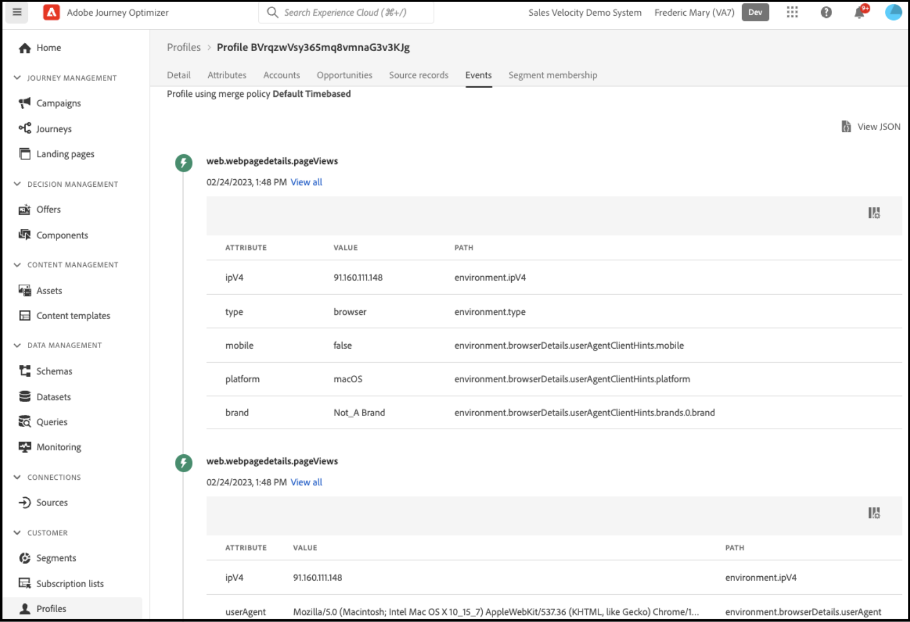

# Använd Adobe Journey Optimizer för att skicka ett övergivet kundvagnsmeddelande

Lär dig hur du kan leverera ett personligt e-postmeddelande om återengagemang om en kundvagn eller webbläsarsession har övergivits. I den här artikeln använder du data som genererats från kunder som har tittat på ett antal produkter och kategorier, använt en produkt eller använt en sida.

## Vilka data bör jag överväga att använda?

Bygg en övergiven kundvagn, bläddra i e-post eller meddelanden med data från butiks- och back office-händelser.

| Datatyper | data från Storefront (beteendehändelser) | Back office-data (händelser på serversidan) |
|---|---|---|
| **Definition** | Klicka på eller vidta de åtgärder som kunderna ska vidta på er webbplats. | Information om livscykeln och detaljer för varje order (tidigare och aktuell). |
| **Evenemang tagna med Adobe Commerce** | [pageView](https://experienceleague.adobe.com/en/docs/commerce-merchant-services/data-connection/event-forwarding/events#pageview) [productPageView](https://experienceleague.adobe.com/en/docs/commerce-merchant-services/data-connection/event-forwarding/events) [addToCart](https://experienceleague.adobe.com/en/docs/commerce-merchant-services/data-connection/event-forwarding/events#addtocart) [openCart](https://experienceleague.adobe.com/en/docs/commerce-merchant-services/data-connection/event-forwarding/events#opencart) [startCheckout](https://experienceleague.adobe.com/en/docs/commerce-merchant-services/data-connection/event-forwarding/events#startcheckout) [completeCheckout](https://experienceleague.adobe.com/en/docs/commerce-merchant-services/data-connection/event-forwarding/events#completecheckout) | [orderPlaced](https://experienceleague.adobe.com/en/docs/commerce-merchant-services/data-connection/event-forwarding/events-backoffice#orderplaced) [Orderhistorik](https://experienceleague.adobe.com/en/docs/commerce-merchant-services/data-connection/fundamentals/connect-data#send-historical-order-data) |

### Vad kan jag göra med bara Adobe Commerce?

Använd Adobe [!DNL Commerce] för att skapa regelbaserade e-postpåminnelser, som kan fungera som kundvagn eller bläddra bland e-postmeddelanden om att kunden överger medlemskapet. Lär dig hur här.

### Vad kan jag göra med Adobe? [!DNL Commerce] och Experience Cloud?

- **Adobe [!DNL Commerce] med Adobe Journey Optimizer** - Använda Adobe [!DNL Commerce] med Adobe Journey Optimizer [!DNL Commerce] data som utlösare för en flerkanalig avhoppsresa. Ni kan personalisera den resan baserat på kundattribut, objekt de överger, andra shoppingbeteenden och tidigare köpbeteenden.

- **Adobe Commerce, Adobe Journey Optimizer och Adobe Real-Time CDP** - Genom att lägga till Real-Time CDP kan ni ytterligare förfina avhoppingskampanjer baserat på enhetliga kundprofiler och centralt hanterade regelbaserade eller AI-baserade målgrupper. Du kan till exempel skapa:

   - En&quot;stark konverterare&quot;-publik med låg avhoppsfrekvens
   - En&quot;högkvalitativ&quot; målgrupp som har granskat vissa kategorier flera gånger
   - En&quot;högpotentiell&quot; målgrupp som har höga kostnader och lojalitet men nyligen har övergett

### Vad har andra kunder gjort?

Adobe [!DNL Commerce] kunderna har uppnått betydande affärsmässiga effekter genom att implementera personaliserade övergivningskampanjer med Adobe [!DNL Commerce], ADOBE [!DNL Journey Optimizer]och Adobe [!DNL Real-Time CDP].

En global klädhandlare med flera varumärken har uppnått följande:

- 1,9 gånger fler klick från nya kampanjer
- 57 % ökning av intäkterna från avhandlingar i flera kanaler
- 41 % ökning av konverteringsgraden för återengagemangskampanjer
- Över 1 000 nya kunder engagerade per vecka

Ett globalt dryckesföretag:

- 36 % återengagerade öppningsfrekvenser för e-post
- 21 % ökning av klickfrekvens
- 8,5 % ökning av konverteringsgraden
- 89 % av alla som överger sitt engagemang konverterar

## Kom så börjar vi

Det här användningsexemplet fokuserar på att skapa ett övergivet kundvagnsmeddelande med data från [!DNL Commerce] -instans och skicka den till Adobe [!DNL Journey Optimizer].

### Vad är Adobe Journey Optimizer?

[Adobe Journey Optimizer](https://experienceleague.adobe.com/docs/journey-optimizer/using/get-started/get-started.html) hjälper er att personalisera handelsupplevelsen för era kunder. Du kan till exempel använda Journey Optimizer för att skapa och leverera schemalagda marknadsföringskampanjer, till exempel veckokampanjer för en butik, eller generera ett övergivet kundvagnsmeddelande om kunden har lagt till en produkt i en kundvagn men sedan inte slutfört utcheckningsprocessen.

I det här avsnittet får du lära dig att skapa ett övergivet kundvagnsmeddelande genom att lyssna på en `checkout` händelse som genererats från [!DNL Commerce] och svara på den händelsen i Journey Optimizer.

>[!IMPORTANT]
>
>Använd [!DNL Commerce] sandlådemiljö så att du inte späder ut data för produktionshändelser med händelsedata för butiker och back office som du skickar till Experience Platform.

### Förutsättningar

Innan du börjar med de här stegen måste du se till:

- Du är redo att använda Adobe [!DNL Journey Optimizer]. Om du är osäker kan du kontakta systemintegratören eller utvecklingsteamet som hanterar projekt och miljöer.
- Du [installerat](install.md) och [konfigurerad](connect-data.md) den [!DNL Data Connection] tillägg i [!DNL Commerce].
- Du [bekräftad](connect-data.md#confirm-that-event-data-is-collected) som [!DNL Commerce] händelsedata kommer till Experience Platform.

## Steg 1: Skapa en användare i [!DNL Commerce] sandlådemiljö

Skapa en användare i sandlådemiljön och bekräfta att användarkontoinformationen visas i Experience Platform. Kontrollera att den e-postadress du angav är giltig eftersom den används senare i det här avsnittet för att skicka övergiven e-postvagn.

1. Logga in eller skapa ett konto i [!DNL Commerce] sandlådemiljö.

   {width="700" zoomable="yes"}

   Med [!DNL Data Connection] tillägg har installerats och konfigurerats. Kontoinformationen skickas till Experience Platform som en profil.

1. Bekräfta att din användarkontoinformation visas i dialogrutan **[!UICONTROL Profile]** i Experience Platform.

   Gå till **[!UICONTROL Profiles]** i Adobe Experience Platform. Klicka **[!UICONTROL Detail]** i profilen för att se den profil du har skapat.

   {width="700" zoomable="yes"}

## Steg 2: Visa händelser i Journey Optimizer

I [!DNL Commerce] sandlådemiljö, aktivera händelser i din butik genom att visa produktsidor, lägga till artiklar i en kundvagn och slutföra olika aktiviteter som en kund skulle utföra. Bekräfta sedan att dessa händelser skickas till Journey Optimizer.

1. Starta [Adobe Journey Optimizer](https://experienceleague.adobe.com/docs/journey-optimizer/using/get-started/user-interface.html).
1. Välj **[!UICONTROL Profiles]**.
1. Ange **[!UICONTROL Identity namespace]** till `Email`.
1. Ange **[!UICONTROL Identity value]** till din e-postadress.
1. Välj din profil och välj sedan **[!UICONTROL Events]** -fliken.

   {width="700" zoomable="yes"}

   Leta efter `commerce.checkouts` händelse och undersöka händelsens nyttolast:

       &quot;json
       &quot;personID&quot;: &quot;8428164306717846578374654350107369488&quot;,
       &quot;eventType&quot;: &quot;commerce.checkouts&quot;,
       &quot;_id&quot;: &quot;4b41703f-e42e-485b-8d63-7001e3580856-0&quot;,
       &quot;commerce&quot;: {
       &quot;kundvagn&quot;: {},
       &quot;utcheckningar&quot;: {
       &quot;value&quot;: 1
       }
       &quot;
   
   Som du ser innehåller den fullständiga händelsenyttolasten omfattande händelsedata. I nästa avsnitt kommer du att konfigurera händelser i Journey Optimizer att lyssna efter och svara på `commerce.checkouts` händelse som genererats från [!DNL Commerce] storefront.

## Steg 3: Konfigurera händelser i Journey Optimizer

Konfigurera två händelser i Journey Optimizer: en händelseavlyssnare för `commerce.checkouts` -händelse från Commerce, och den andra är en grundläggande timeout-händelse som väntar en viss tid innan en övergiven kundvagn aktiveras.

### Skapa en avlyssnarhändelse

1. Starta [Adobe Journey Optimizer](https://experienceleague.adobe.com/docs/journey-optimizer/using/get-started/user-interface.html).

1. Klicka **[!UICONTROL Configurations]** under **[!UICONTROL Administration]** i den vänstra rutan.

1. I **[!UICONTROL Events]** platta, klicka **[!UICONTROL Manage]**.

   {width="700" zoomable="yes"}

1. På **[!UICONTROL Events]** sida, klicka **[!UICONTROL Create Event]**.

1. Ställ in händelsen på följande sätt i den högra navigeringen:

   1. Ange **[!UICONTROL Name]** till: `firstname_lastname_checkout`.
   1. Ange **[!UICONTROL Type]** till **[!UICONTROL Unitary]**.
   1. Ange **[!UICONTROL Event id typ]e** till **[!UICONTROL Rule based]**.
   1. Ange **[!UICONTROL Schema]** till [!DNL Commerce] [schema](update-xdm.md).
   1. Välj **[!UICONTROL Fields]** för att öppna **[!UICONTROL Fields]** sida. Markera sedan de fält som är användbara för den här händelsen. Markera t.ex. alla fält under **[!UICONTROL Product list items]**, **[!UICONTROL Commerce]**, **[!UICONTROL eventType]** och **[!UICONTROL Web]**.
   1. Klicka **[!UICONTROL OK]** för att spara de markerade fälten.
   1. Klicka inuti **[!UICONTROL Event id condition]** fält. Skapa sedan ett villkor: `eventType` är lika med `commerce.checkouts` OCH `personalEmail.address` är lika med den e-postadress som du använde när du skapade profilen i föregående avsnitt.

      {width="700" zoomable="yes"}

   1. Klicka på **[!UICONTROL OK]**.
   1. Klicka **[!UICONTROL Save]** för att spara din aktivitet.

### Skapa en timeout-händelse

1. Skapa ett event i Journey Optimizer som du gjorde tidigare.

1. Ställ in händelsen på följande sätt i den högra navigeringen:

   1. Ange **[!UICONTROL Name]** till: `firstname_lastname_timeout`.
   1. Ange **[!UICONTROL Type]** till **[!UICONTROL Unitary]**.
   1. Ange **[!UICONTROL Event id type]** till **[!UICONTROL Rule based]**.
   1. Ange **[!UICONTROL Schema]** till [!DNL Commerce] [schema](update-xdm.md).
   1. Ange **[!UICONTROL Schema]**, **[!UICONTROL Fields]** och **[!UICONTROL Event id condition]** på samma sätt som ovan.
   1. Klicka **[!UICONTROL Save]** för att spara din aktivitet.

När dessa två händelser är konfigurerade kan du skapa en resa som skickar ett övergivet kundvagnsmeddelande.

## Steg 4: Bygg en utcheckningsresa

Skapa en resa som lyssnar efter `commerce.checkouts` och skickar sedan en övergiven kundvagn via e-post när en viss tid har gått.

1. I Journey Optimizer: **[!UICONTROL Journeys]** under **J[!UICONTROL OURNEY MANAGEMENT]**.
1. Klicka på **[!UICONTROL Create Journey]**.
1. Ange namnet på din resa.
1. Klicka **[!UICONTROL OK]** för att rädda resan.
1. Navigering till vänster under **[!UICONTROL EVENTS]** söker du efter den utcheckningshändelse du skapade: `firstname_lastname_checkout` och dra och släpp det på arbetsytan.

   >[!TIP]
   >
   >Om du dubbelklickar på händelsen läggs den automatiskt till på arbetsytan.

1. Sök efter timeout-händelsen och lägg till den på arbetsytan.
1. Dubbelklicka på timeout-händelsen.

   1. I **[!UICONTROL Timeout]** väljer du **[!UICONTROL Define the event time]** kryssrutan.
   1. I **[!UICONTROL Wait for]** fältpost `1` och `Minute`.
   1. Välj **[!UICONTROL Set a timeout path]** kryssrutan.

   Med den här timeoutkonfigurationen utlöses den här tidsgränsen av en kund som utför en utcheckning men inte slutför ordern inom en minut. I en faktisk produktionsmiljö skulle du ange detta för en längre period, som 24 timmar.

1. Navigering till vänster under **[!UICONTROL ACTIONS]**, lägg till **[!UICONTROL Email]** till timeout-grenen. Resan ska se ut så här:

   {width="700" zoomable="yes"}

### Skapa en övergiven kundvagn

Skapa en övergiven kundvagn som skickas när en övergiven kundvagn identifieras.

1. Dubbelklicka på **[!UICONTROL Email]** på arbetsytan.

1. Följ [steg](https://experienceleague.adobe.com/docs/journey-optimizer/using/content-management/personalization/personalization-use-cases/personalization-use-case-helper-functions.html#configure-email) i Journey Optimizer guide för att skapa övergivna kundvagnsmeddelanden.

Nu har du en resa i Journey Optimizer som lyssnar efter `commerce.checkouts` aktivitet från [!DNL Commerce] och en övergiven kundvagn som skickas efter att en viss tid har gått. I nästa avsnitt visas hur du testar resan.

## Steg 5: Starta utcheckningshändelsen i realtid

I det här avsnittet testar du händelsen i realtid.

1. I Journey Optimizer växlar du till testläge.

   {width="700" zoomable="yes"}

1. Om du vill testa resan i realtid öppnar du en annan webbläsarflik och går till [!DNL Commerce] i din sandlådemiljö.

   1. Lägg en produkt i kundvagnen.
   1. Gå till utcheckningssidan.
   1. Gå till kassan och överge vagnen genom att gå tillbaka till huvudsidan eller stänga fliken.

      Resan är nu utlöst. Bekräfta genom att öppna fliken som du har besökt i Journey Optimizer. Du bör se en grön pil som visar den sökväg som användaren gick igenom.

1. Kontrollera din inkorg för e-postmeddelandet.
