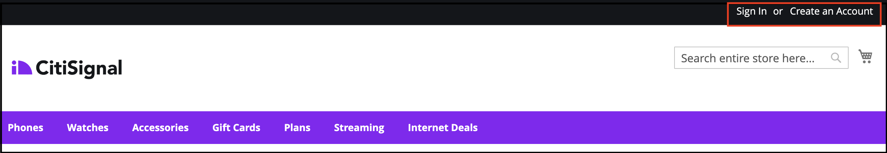

# Använd Adobe Journey Optimizer för att skicka ett övergivet kundvagnsmeddelande

[Adobe Journey Optimizer](https://experienceleague.adobe.com/docs/journey-optimizer/using/get-started/get-started.html) hjälper er att personalisera handelsupplevelsen för era kunder. Du kan till exempel använda Journey Optimizer för att skapa och leverera schemalagda marknadsföringskampanjer, till exempel veckokampanjer för en butik, eller generera ett övergivet kundvagnsmeddelande om kunden har lagt till en produkt i en kundvagn men sedan inte slutfört utcheckningsprocessen.

Genom att följa de här stegen kan du lära dig att lyssna på en `checkout` händelse som genererats från din Commerce-instans och som svarar på den händelsen i Journey Optimizer för att skapa ett övergivet kundvagnsmeddelande.

>[!IMPORTANT]
>
>Se till att du använder din Commerce-sandlådemiljö i demonstrationssyfte. Detta garanterar att händelsedata för butiken och back office som du skickar till Experience Platform inte späder ut dina data för produktionshändelser.

## Förutsättningar

Innan du börjar med de här stegen måste du se till:

- Du är redo att använda Adobe Journey Optimizer
- Du [konfigurerad](connect-data.md) den [!DNL Data Connection] extension
- Du [bekräftad](connect-data.md#confirm-that-event-data-is-collected) att dina Commerce-händelsedata kommer till Experience Platform

## Steg 1: Skapa en användare i din Commerce-sandlådemiljö

Skapa en användare i sandlådemiljön och bekräfta att användarkontoinformationen visas i Experience Platform. Kontrollera att den e-postadress du angav är giltig eftersom den används senare i det här avsnittet för att skicka övergiven e-postvagn.

1. Logga in eller skapa ett konto i din Commerce-sandlådemiljö.

   {width="700" zoomable="yes"}

   Med [!DNL Data Connection] tillägg har installerats och konfigurerats. Kontoinformationen skickas till Experience Platform som en profil.

1. Bekräfta att din användarkontoinformation visas i dialogrutan **[!UICONTROL Profile]** i Experience Platform.

   Gå till **[!UICONTROL Profiles]** i Adobe Experience Platform. Klicka **[!UICONTROL Detail]** i profilen för att se den profil du har skapat.

   {width="700" zoomable="yes"}

## Steg 2: Visa händelser i Journey Optimizer

I din Commerce-sandlådemiljö kan du visa produktsidor, lägga till artiklar i en kundvagn och olika andra aktiviteter som en kund utför. De här aktiviteterna utlöser händelser i din butik. Du kan nu bekräfta att dessa händelser skickas till Journey Optimizer.

1. Starta [Adobe Journey Optimizer](https://experienceleague.adobe.com/docs/journey-optimizer/using/get-started/user-interface.html).
1. Välj **[!UICONTROL Profiles]**.
1. Ange **[!UICONTROL Identity namespace]** till `Email`.
1. Ange **[!UICONTROL Identity value]** till din e-postadress.
1. Välj din profil och välj sedan **[!UICONTROL Events]** -fliken.

   {width="700" zoomable="yes"}

   Leta efter `commerce.checkouts` händelse och undersöka händelsens nyttolast:

   ```json
   "personID": "84281643067178465783746543501073369488", 
   "eventType": "commerce.checkouts", 
   "_id": "4b41703f-e42e-485b-8d63-7001e3580856-0", 
   "commerce": { 
       "cart": {}, 
       "checkouts": { 
           "value": 1 
       } 
   ```

   Som du ser innehåller den fullständiga händelsenyttolasten omfattande händelsedata. I nästa avsnitt kommer du att konfigurera händelser i Journey Optimizer att lyssna efter och svara på `commerce.checkouts` händelse som har genererats från din Commerce Store.

## Steg 3: Konfigurera händelser i Journey Optimizer

Konfigurera två händelser i Journey Optimizer: en händelseavlyssnare för `commerce.checkouts` -händelse från Commerce, och den andra är en grundläggande timeout-händelse som väntar en viss tid innan en övergiven kundvagn aktiveras.

### Skapa en avlyssnarhändelse

1. Starta [Adobe Journey Optimizer](https://experienceleague.adobe.com/docs/journey-optimizer/using/get-started/user-interface.html).

1. Klicka **[!UICONTROL Configurations]** under **[!UICONTROL Administration]** i den vänstra rutan.

1. I **[!UICONTROL Events]** platta, klicka **[!UICONTROL Manage]**.

   {width="700" zoomable="yes"}

1. På **[!UICONTROL Events]** sida, klicka **[!UICONTROL Create Event]**.

1. Ställ in händelsen på följande sätt i den högra navigeringen:

   1. Ange **[!UICONTROL Name]** till: `firstname_lastname_checkout`.
   1. Ange **[!UICONTROL Type]** till **[!UICONTROL Unitary]**.
   1. Ange **[!UICONTROL Event id typ]e** till **[!UICONTROL Rule based]**.
   1. Ange **[!UICONTROL Schema]** till din e-handel [schema](update-xdm.md).
   1. Välj **[!UICONTROL Fields]** och i **[!UICONTROL Fields]** väljer du de fält som är användbara för den här händelsen. Markera t.ex. alla fält under **[!UICONTROL Product list items]**, **[!UICONTROL Commerce]**, **[!UICONTROL eventType]** och **[!UICONTROL Web]**.
   1. Klicka **[!UICONTROL OK]** för att spara de markerade fälten.
   1. Klicka inuti **[!UICONTROL Event id condition]** fält och skapa ett villkor för `eventType` är lika med `commerce.checkouts` OCH `personalEmail.address` är lika med den e-postadress som du använde när du skapade profilen i föregående avsnitt.

      {width="700" zoomable="yes"}

   1. Klicka på **[!UICONTROL OK]**.
   1. Klicka **[!UICONTROL Save]** för att spara din aktivitet.

### Skapa en timeout-händelse

1. Skapa ett event i Journey Optimizer som du gjorde tidigare.

1. Ställ in händelsen på följande sätt i den högra navigeringen:

   1. Ange **[!UICONTROL Name]** till: `firstname_lastname_timeout`.
   1. Ange **[!UICONTROL Type]** till **[!UICONTROL Unitary]**.
   1. Ange **[!UICONTROL Event id typ]e** till **[!UICONTROL Rule based]**.
   1. Ange **[!UICONTROL Schema]** till din e-handel [schema](update-xdm.md).
   1. Ange **[!UICONTROL Schema]**, **[!UICONTROL Fields]** och **[!UICONTROL Event id condition]** på samma sätt som ovan.
   1. Klicka **[!UICONTROL Save]** för att spara din aktivitet.

När dessa två händelser är konfigurerade kan du skapa en resa som skickar ett övergivet kundvagnsmeddelande.

## Steg 4: Bygg en utcheckningsresa

Skapa en resa som lyssnar efter `commerce.checkouts` och skickar sedan en övergiven kundvagn via e-post när en viss tid har gått.

1. I Journey Optimizer: **[!UICONTROL Journeys]** under **J[!UICONTROL OURNEY MANAGEMENT]**.
1. Klicka på **[!UICONTROL Create Journey]**.
1. Ange namnet på din resa.
1. Klicka **[!UICONTROL OK]** för att rädda resan.
1. Navigering till vänster under **[!UICONTROL EVENTS]** söker du efter den utcheckningshändelse du skapade: `firstname_lastname_checkout` och dra och släpp det på arbetsytan.

   >[!TIP]
   >
   >Om du dubbelklickar på händelsen läggs den automatiskt till på arbetsytan.

1. Sök efter timeout-händelsen och lägg till den på arbetsytan.
1. Dubbelklicka på timeout-händelsen.

   1. I **[!UICONTROL Timeout]** väljer du **[!UICONTROL Define the event time]** kryssrutan.
   1. I **[!UICONTROL Wait for]** fältpost `1` och `Minute`.
   1. Välj **[!UICONTROL Set a timeout path]** kryssrutan.

   Med den här timeoutkonfigurationen utlöses den här tidsgränsen av en kund som utför en utcheckning men inte slutför ordern inom en minut. I en faktisk produktionsmiljö skulle du ange detta för en längre period, som 24 timmar.

1. Navigering till vänster under **[!UICONTROL ACTIONS]**, lägg till **[!UICONTROL Email]** till timeout-grenen. Resan ska se ut så här:

   {width="700" zoomable="yes"}

### Skapa en övergiven kundvagn

Skapa en övergiven kundvagn som skickas när en övergiven kundvagn identifieras.

1. Dubbelklicka på **[!UICONTROL Email]** på arbetsytan.

1. Följ [steg](https://experienceleague.adobe.com/docs/journey-optimizer/using/content-management/personalization/personalization-use-cases/personalization-use-case-helper-functions.html#configure-email) i Journey Optimizer guide för att skapa övergivna kundvagnsmeddelanden.

Nu har du en resa i Journey Optimizer som lyssnar efter `commerce.checkouts` händelse från din Commerce Store och ett övergivet kundvagnsmeddelande som skickas efter en tidsperiod. I nästa avsnitt ska du testa resan.

## Steg 5: Starta utcheckningshändelsen i realtid

I det här avsnittet testar du händelsen i realtid.

1. I Journey Optimizer växlar du till testläge.

   {width="700" zoomable="yes"}

1. Om du vill testa den här resan i realtid öppnar du en annan webbläsarflik och går till din webbplats för sandlådehandel.

   1. Lägg en produkt i kundvagnen.
   1. Gå till utcheckningssidan.
   1. Gå till kassan och överge vagnen genom att gå tillbaka till huvudsidan eller stänga fliken.

      Resan är nu utlöst. Bekräfta genom att öppna fliken som du har besökt i Journey Optimizer. Du bör se en grön pil som visar den sökväg som användaren gick igenom.

1. Kontrollera din inkorg för e-postmeddelandet.
