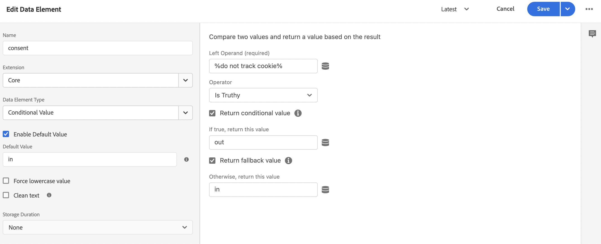

# Samla in handelsdata med Adobe Experience Platform-taggar

Du kan använda [!DNL Data Connection] för att publicera och prenumerera på butikshändelser. Vissa handlare kanske redan använder en datainsamlingslösning, som [Adobe Experience Platform-taggar](https://experienceleague.adobe.com/docs/platform-learn/data-collection/tags/create-a-property.html). För dessa handlare har Adobe Commerce ett alternativ för publicering i [!DNL Data Connection] som använder Adobe Commerce Event SDK.

![[!DNL Data Connection] Dataflöde för tillägg](assets/tags-data-flow.png)
_[!DNL Data Connection]Tilläggsdataflöde med taggar_

I det här avsnittet får du lära dig att mappa värdena för händelsen storefront som finns i [!DNL Data Connection] till den tagg för Adobe Experience Platform som du redan använder.

## Samla in händelsedata från Adobe Commerce

Så här samlar du in händelsedata för Commerce:

- Installera [Adobe Commerce Events SDK](https://github.com/adobe/commerce-events/tree/main/packages/storefront-events-sdk). Information om PHP-butiker finns i [installera](install.md) ämne. För PWA Studio storefront, se [PWA Studio guide](https://developer.adobe.com/commerce/pwa-studio/integrations/adobe-commerce/aep/).

  >[!NOTE]
  >
  > Gör **not** [konfigurera](connect-data.md) Organisations-ID och DataStream-ID.

## Mappa Commerce-butiksdata till Adobe Experience Platform

Om du vill mappa Commerce storefront-data till Adobe Experience Platform konfigurerar och installerar du följande inifrån Adobe Experience Platform-taggar:

1. [Konfigurera en taggegenskap](https://experienceleague.adobe.com/docs/platform-learn/implement-in-websites/configure-tags/create-a-property.html) i Adobe Experience Platform Data Collection.

1. Under **Redigering**, markera **Tillägg** och installera och konfigurera följande tillägg:

   - [Adobe-klientdatalager](https://experienceleague.adobe.com/docs/experience-platform/tags/extensions/client/client-data-layer/overview.html)

   - [Adobe Experience Platform Web SDK](https://experienceleague.adobe.com/docs/experience-platform/edge/fundamentals/installing-the-sdk.html)

1. [Publiceringstagg](https://experienceleague.adobe.com/docs/experience-platform/tags/publish/overview.html) i er utvecklingsmiljö.

1. Följ **Händelsemappning** steg nedan för att konfigurera dataelement och regler för specifika händelser.

### Händelsemappning

Eftersom datainsamling med hjälp av taggar skiljer sig från användning av Adobe Commerce Event SDK är det viktigt att förstå de likvärdiga termer som används i båda ramverken.

| Adobe Experience Platform tagg term | Adobe Commerce Event SDK term |
|---|---|
| _dataelement_ | kontext |
| _regler_ | event |
|  | _regelvillkor_ - händelseavlyssnare (från ACDL)<br><br>_regelåtgärder_ - händelsehanterare (skicka till Adobe Experience Platform) |

När du uppdaterar dataelementen och reglerna i Adobe Experience Platform-taggar med Adobe Commerce-specifika händelsedata, finns det några vanliga åtgärder som du kommer att vidta.

Låt oss till exempel lägga till Adobe Commerce `signOut` till Adobe Experience Platform-taggar. Stegen som beskrivs nedan, förutom de värden du anger, beskriver hur du lägger till [dataelement](https://experienceleague.adobe.com/docs/experience-platform/collection/e2e.html#data-element) och [regler](https://experienceleague.adobe.com/docs/experience-platform/collection/e2e.html#create-a-rule)som gäller för alla Adobe Commerce-händelser som du lägger till i -taggar.

1. Skapa ett dataelement:

   
   _Skapa nytt dataelement_

1. Ange **Namn** till `sign out`.

1. Ange **Tillägg** till `Adobe Experience Platform Web SDK`.

1. Ange **Dataelementtyp** till `XDM object`.

1. Välj **Sandbox** och **Schema** som du vill uppdatera.

1. Under **userAccount** > **utloggning**, ange **value** in **Logga ut som besökare** till `1`.

   
   _Uppdatera utloggningsvärde_

1. Välj **Spara**.

1. Skapa en regel:

   
   _Skapa ny regel_

1. Välj **Lägg till** under **HÄNDELSER**.

1. Ange **Tillägg** till `Adobe Client Data Layer`.

1. Ange **Händelsetyp** till `Data Pushed`.

1. Välj **Specifik händelse** och ange **Händelse/nyckel att registrera för** till `sign-out`.

1. Välj **Behåll ändringar** för att spara den nya regeln.

1. Lägg till en åtgärd.

1. Ange **Tillägg** till `Adobe Experience Platform Web SDK`.

1. Ange **Åtgärdstyp** till `Send Event`.

1. Ange **Instance** till `Alloy`.

1. Ange **Typ** till `userAccount.logout`.

1. Ange **XDM-data** till `%sign out%`.

1. Klicka **Spara**.

   Du skapade ett dataelement i ditt schema för `signOut` event från Adobe Commerce. Du har också skapat en regel med en specifik åtgärd som ska utföras när händelsen utlöses från Adobe Commerce store.

Upprepa stegen ovan i taggar för var och en av de Adobe Commerce-händelser som beskrivs nedan.

## Tillgängliga händelser

För var och en av följande händelser mappar du Adobe Commerce-händelserna till din XDM genom att följa stegen ovan.

- [&quot;signOut&quot;](#signout)
- [&quot;signIn&quot;](#signin)
- [&quot;createAccount&quot;](#createaccount)
- [`editAccount`](#editaccount)
- [`pageView`](#pageview)
- [&quot;productView&quot;](#productview)
- [`searchRequestSent`](#searchrequestsent)
- [`searchResponseReceived`](#searchresponsereceived)
- [`addToCart`](#addtocart)
- [&quot;openCart&quot;](#opencart)
- [&quot;viewCart&quot;](#viewcart)
- [`removeFromCart`](#removefromcart)
- [&quot;initieraUtcheckning&quot;](#initiatecheckout)
- [`placeOrder`](#placeorder)

### signOut

Utlöses när en kund försöker logga ut.

#### Dataelement

Skapa följande dataelement:

1. Logga ut:

   - **Namn**: `Sign out`
   - **Tillägg**: `Adobe Experience Platform Web SDK`
   - **Dataelementtyp**: `XDM object`
   - **Fältgrupp**: `userAccount` > `logout`
   - **Logga ut som besökare**: **Värde** = `1`

#### Regler 

- **Namn**: `Sign out`
- **Tillägg**: `Adobe Client Data Layer`
- **Händelsetyp**: `Data Pushed`
- **Specifik händelse**: `sign-out`

##### Åtgärder

- **Tillägg**: `Adobe Experience Platform Web SDK`
- **Åtgärdstyp**: `Send event`
- **Typ**: `userAccount.logout`
- **XDM-data**: `%sign-out%`

### signIn

Utlöses när en kund försöker logga in.

#### Dataelement

Skapa följande dataelement:

1. E-postadress för konto:

   - **Namn**: `account email`
   - **Tillägg**: `Adobe Client Data Layer`
   - **Dataelementtyp**: `Data Layer Computed State`
   - **[Valfritt] bana**: `accountContext.emailAddress`

1. Kontotyp:

   - **Namn**: `account type`
   - **Tillägg**: `Adobe Client Data Layer`
   - **Dataelementtyp**: `Data Layer Computed State`
   - **[Valfritt] bana**: `accountContext.accountType`

1. Konto-ID:

   - **Namn**: `account id`
   - **Tillägg**: `Adobe Client Data Layer`
   - **Dataelementtyp**: `Data Layer Computed State`
   - **[Valfritt] bana***: `accountContext.accountId`

1. Logga in:

   - **Namn**: `sign in`
   - **Tillägg**: `Adobe Experience Platform Web SDK`
   - **Dataelementtyp**: `XDM object`
   - **Fältgrupp**: `person` > `accountID`
   - **Konto-ID**: **Värde** = `%account id%`
   - **Fältgrupp**: `person` > `accountType`
   - **Kontotyp**: **Värde** = `%account type%`
   - **Fältgrupp**: `person` > `personalEmailID`
   - **Personlig e-postadress**: **Värde** = `%account email%`
   - **Fältgrupp**: `personalEmail` > `address`
   - **Adress**: **Värde** = `%account email%`
   - **Fältgrupp**: `userAccount` > `login`
   - **Besökarinloggning**: **Värde** = `1`

#### Regler 

- **Namn**: `sign in`
- **Tillägg**: `Adobe Client Data Layer`
- **Händelsetyp**: `Data Pushed`
- **Specifik händelse**: `sign-in`

##### Åtgärder

- **Tillägg**: `Adobe Experience Platform Web SDK`
- **Åtgärdstyp**: `Send event`
- **Typ**: `userAccount.login`
- **XDM-data**: `%sign in%`

### createAccount

Utlöses när en kund försöker skapa ett konto.

#### Dataelement

Skapa följande dataelement:

1. E-postadress för konto:

   - **Namn**: `account email`
   - **Tillägg**: `Adobe Client Data Layer`
   - **Dataelementtyp**: `Data Layer Computed State`
   - **[Valfritt] bana**: `accountContext.emailAddress`

1. Kontotyp:

   - **Namn**: `account type`
   - **Tillägg**: `Adobe Client Data Layer`
   - **Dataelementtyp**: `Data Layer Computed State`
   - **[Valfritt] bana**: `accountContext.accountType`

1. Konto-ID:

   - **Namn**: `account id`
   - **Tillägg**: `Adobe Client Data Layer`
   - **Dataelementtyp**: `Data Layer Computed State`
   - **[Valfritt] bana**: `accountContext.accountId`

1. Skapa konto:

   - **Namn**: `Create account`
   - **Tillägg**: `Adobe Experience Platform Web SDK`
   - **Dataelementtyp**: `XDM object`
   - **Fältgrupp**: `person` > `accountID`
   - **Konto-ID**: **Värde** = `%account id%`
   - **Fältgrupp**: `person` > `accountType`
   - **Kontotyp**: **Värde** = `%account type%`
   - **Fältgrupp**: `person` > `personalEmailID`
   - **Personlig e-postadress**: **Värde** = `%account email%`
   - **Fältgrupp**: `personalEmail` > `address`
   - **Adress**: **Värde** = `%account email%`
   - **Fältgrupp**: `userAccount` > `createProfile`
   - **Skapa kontoprofil**: **Värde** = `1`

#### Regler 

- **Namn**: `Create account`
- **Tillägg**: `Adobe Client Data Layer`
- **Händelsetyp**: `Data Pushed`
- **Specifik händelse**: `create-account`

##### Åtgärder

- **Tillägg**: `Adobe Experience Platform Web SDK`
- **Åtgärdstyp**: `Send event`
- **Typ**: `userAccount.createProfile`
- **XDM-data**: `%create account%`

### editAccount

Utlöses när en kund försöker redigera ett konto.

#### Dataelement

Skapa följande dataelement:

1. E-postadress för konto:

   - **Namn**: `account email`
   - **Tillägg**: `Adobe Client Data Layer`
   - **Dataelementtyp**: `Data Layer Computed State`
   - **[Valfritt] bana**: `accountContext.emailAddress`

1. Kontotyp:

   - **Namn**: `account type`
   - **Tillägg**: `Adobe Client Data Layer`
   - **Dataelementtyp**: `Data Layer Computed State`
   - **[Valfritt] bana**: `accountContext.accountType`

1. Konto-ID:

   - **Namn**: `account id`
   - **Tillägg**: `Adobe Client Data Layer`
   - **Dataelementtyp**: `Data Layer Computed State`
   - **[Valfritt] bana**: `accountContext.accountId`

1. Redigera konto:

   - **Namn**: `Edit account`
   - **Tillägg**: `Adobe Experience Platform Web SDK`
   - **Dataelementtyp**: `XDM object`
   - **Fältgrupp**: `person` > `accountID`
   - **Konto-ID**: **Värde** = `%account id%`
   - **Fältgrupp**: `person` > `accountType`
   - **Kontotyp**: **Värde** = `%account type%`
   - **Fältgrupp**: `person` > `personalEmailID`
   - **Personlig e-postadress**: **Värde** = `%account email%`
   - **Fältgrupp**: `personalEmail` > `address`
   - **Adress**: **Värde** = `%account email%`
   - **Fältgrupp**: `userAccount` > `updateProfile`
   - **Skapa kontoprofil**: **Värde** = `1`

#### Regler

- **Namn**: `Edit account`
- **Tillägg**: `Adobe Client Data Layer`
- **Händelsetyp**: `Data Pushed`
- **Specifik händelse**: `edit-account`

##### Åtgärder

- **Tillägg**: `Adobe Experience Platform Web SDK`
- **Åtgärdstyp**: `Send event`
- **Typ**: `userAccount.updateProfile`
- **XDM-data**: `%edit account%`

### pageView

Utlöses när någon sida läses in.

#### Dataelement

Skapa följande dataelement:

1. Sidnamn:

   - **Namn**: `page name`
   - **Tillägg**: `Adobe Client Data Layer`
   - **Dataelementtyp**: `Data Layer Computed State`
   - **[Valfritt] bana**: `pageContext.pageName`

#### Regler 

- **Namn**: `page view`
- **Tillägg**: `Adobe Client Data Layer`
- **Händelsetyp**: `Data Pushed`
- **Specifik händelse**: `page-view`

##### Åtgärder

- **Tillägg**: `Adobe Experience Platform Web SDK`
- **Åtgärdstyp**: `Send event`
- **Typ**: `web.webPageDetails.pageViews`
- **XDM-data**: `%page view%`

### productView

Utlöses när någon produktsida läses in.

#### Dataelement

Skapa följande dataelement:

1. Produktnamn:

   - **Namn**: `product name`
   - **Tillägg**: `Adobe Client Data Layer`
   - **Dataelementtyp**: `Data Layer Computed State`
   - **[Valfritt] bana**: `productContext.name`

1. SKU:

   - **Namn**: `product sku`
   - **Tillägg**: `Adobe Client Data Layer`
   - **Dataelementtyp**: `Data Layer Computed State`
   - **[Valfritt] bana**: `productContext.sku`

1. Produktbild-URL:

   - **Namn**: `product image`
   - **Tillägg**: `Adobe Client Data Layer`
   - **Dataelementtyp**: `Data Layer Computed State`
   - **[Valfritt] bana**: `productContext.mainImageUrl`

1. Produktvaluta:

   - **Namn**: `product currency`
   - **Tillägg**: `Adobe Client Data Layer`
   - **Dataelementtyp**: `Data Layer Computed State`
   - **[Valfritt] bana**: `productContext.pricing.currencyCode`

1. Valutakod:

   - **Namn**: `currency code`
   - **Tillägg**: `Core`
   - **Dataelementtyp**: `Custom Code`
   - **Öppna redigeraren**:

   ```bash
   return _satellite.getVar('product currency') || _satellite.getVar('storefront').storeViewCurrencyCode
   ```

1. Specialpris:

   - **Namn**: `special price`
   - **Tillägg**: `Adobe Client Data Layer`
   - **Dataelementtyp**: `Data Layer Computed State`
   - **[Valfritt] bana**: `productContext.pricing.specialPrice`

1. Ordinarie pris:

   - **Namn**: `regular price`
   - **Tillägg**: `Adobe Client Data Layer`
   - **Dataelementtyp**: `Data Layer Computed State`
   - **[Valfritt] bana**: `productContext.pricing.regularPrice`

1. Produktpris:

   - **Namn**: `product price`
   - **Tillägg**: `Core`
   - **Dataelementtyp**: `Custom Code`
   - **Öppna redigeraren**:

   ```bash
   return _satellite.getVar('product regular price') || _satellite.getVar('product special price')
   ```

1. Produktvy:

   - **Namn**: `product view`
   - **Tillägg**: `Adobe Experience Platform Web SDK`
   - **Dataelementtyp**: `XDM object`
   - **Fältgrupp**: `productListItems`. Välj **Ange enskilda objekt** och klicka på **Lägg till objekt** -knappen. Eftersom den här vyn är för en PDP-fil kan du fylla med ett enstaka objekt.
   - **Fältgrupp**: `productListItems` > `name`
   - **Namn**: **Värde** = `%product name%`
   - **Fältgrupp**: `productListItems` > `SKU`
   - **SKU**: **Värde** = `%product sku%`
   - **Fältgrupp**: `productListItems` > `priceTotal`
   - **Prissumma**: **Värde** = `%product price%`
   - **Fältgrupp**: `productListItems` > `currencyCode`
   - **Valutakod**: **Värde** = `%currency code%`
   - **Fältgrupp**: `productListItems` > `ProductImageUrl`
   - **ProductImageUrl**: **Värde** = `%product image%`
   - **Fältgrupp**: `commerce` > `productViews` > `value`
   - **value**: **Värde** = `1`

#### Regler 

- **Namn**: `product view`
- **Tillägg**: `Adobe Client Data Layer`
- **Händelsetyp**: `Data Pushed`
- **Specifik händelse**: `product-page-view`

##### Åtgärder

- **Tillägg**: `Adobe Experience Platform Web SDK`
- **Åtgärdstyp**: `Send event`
- **Typ**: `commerce.productViews`
- **XDM-data**: `%product view%`

### searchRequestSent

Utlöses av händelser i&quot;sökningen när du skriver&quot; och av händelser på sökresultatsidorna.

#### Dataelement

Skapa följande dataelement:

1. Sök indata

   - **Namn**: `search input`
   - **Tillägg**: `Adobe Client Data Layer`
   - **Dataelementtyp**: `Data Layer Computed State`
   - **[Valfritt] bana**: `searchInputContext.units[0]`

1. Sök inmatningsfras

   - **Namn**: `search input phrase`
   - **Tillägg**: `Core`
   - **Dataelementtyp**: `Custom Code`
   - **Öppna redigeraren**:

   ```bash
   return _satellite.getVar('search input').phrase;
   ```

1. Sortera indata

   - **Namn**: `search input sort`
   - **Tillägg**: `Core`
   - **Dataelementtyp**: `Custom Code`
   - **Öppna redigeraren**:

   ```bash
   const searchInput = _satellite.getVar('search input');
   const sortFromInput = searchInput ? searchInput.sort : [];
   const sort = sortFromInput.map((searchSort) => {
       return {
           attribute: searchSort.attribute,
           order: searchSort.direction,
       };
   });
   return sort;
   ```

1. Indatafilter för sökning

   - **Namn**: `search input filters`
   - **Tillägg**: `Core`
   - **Dataelementtyp**: `Custom Code`
   - **Öppna redigeraren**:

   ```bash
   const searchInput = _satellite.getVar('search input');
   const filtersFromInput = searchInput ? searchInput.filter : [];
   const filters = filtersFromInput.map(
       (searchFilter) => {
           let value = [];
           let isRange = false;
           if (searchFilter.eq) {
               value.push(searchFilter.eq);
           } else if (searchFilter.in) {
               value = searchFilter.in;
           } else if (searchFilter.range) {
               isRange = true;
               value.push(String(searchFilter.range.from));
               value.push(String(searchFilter.range.to));
           }
           return {
               attribute: searchFilter.attribute,
               value,
               isRange,
           };
       }
   );
   
   return filters;
   ```

1. Sökbegäran:

   - **Namn**: `search request`
   - **Tillägg**: `Adobe Experience Platform Web SDK`
   - **Dataelementtyp**: `XDM object`
   - **Fältgrupp**: `siteSearch` > `phrase`
   - **value**: Inte tillgängligt ännu
   - **Fältgrupp**: `siteSearch` > `sort`. Välj **Ange hela objektet**.
   - **Fältgrupp**: `siteSearch` > `filter`. Välj **Ange hela objektet**.
   - **Fältgrupp**: `searchRequest` > `id`
   - **Unik identifierare**: **Värde** = `%search request ID%`
   - **Fältgrupp**: `searchRequest` > `value`
   - **value**: **Värde** = `1`

#### Regler 

- **Namn**: `search request sent`
- **Tillägg**: `Adobe Client Data Layer`
- **Händelsetyp**: `Data Pushed`
- **Specifik händelse**: `search-request-sent`

##### Åtgärder

- **Tillägg**: `Adobe Experience Platform Web SDK`
- **Åtgärdstyp**: `Send event`
- **Typ**: `searchRequest`
- **XDM-data**: `%search request%`

### searchResponseReceived

Utlöses när Live Search returnerar resultat för&quot;sökningen när du skriver&quot;-povern eller sökresultatsidan.

#### Dataelement

Skapa följande dataelement:

1. Sökresultat:

   - **Namn**: `search results`
   - **Tillägg**: `Adobe Client Data Layer`
   - **Dataelementtyp**: `Data Layer Computed State`
   - **[Valfritt] bana**: `searchResultsContext.units[0]`

1. Resultatnummer för sökning:

   - **Namn**: `search result number of products`
   - **Tillägg**: `Core`
   - **Dataelementtyp**: `Custom Code`
   - **Öppna redigeraren**:

   ```bash
   return _satellite.getVar('search result').products.length;
   ```

1. Resultatprodukter för sökning:

   - **Namn**: `search result products`
   - **Tillägg**: `Core`
   - **Dataelementtyp**: `Custom Code`
   - **Öppna redigeraren**:

   ```bash
   const searchResult = _satellite.getVar('search result');
   const productsFromResult = searchResult.products ? searchResult.products : [];
   const products = productsFromResult.map(
       (product) => {
           return { SKU: product.sku, name: product.name };
       }
   );
   return products;
   ```

1. Sökresultatförslag:

   - **Namn**: `search result products`
   - **Tillägg**: `Core`
   - **Dataelementtyp**: `Custom Code`
   - **Öppna redigeraren**:

   ```bash
   const searchResult = _satellite.getVar('search result');
   const suggestionsFromResult = searchResult.suggestions ? searchResult.suggestions : [];
   const suggestions = suggestionsFromResult.map((suggestion) => suggestion.suggestion);
   return suggestions;
   ```

1. Produktbild-URL:

   - **Namn**: `product image`
   - **Tillägg**: `Adobe Client Data Layer`
   - **Dataelementtyp**: `Data Layer Computed State`
   - **[Valfritt] bana**: `productContext.mainImageUrl`

1. Söksvar:

   - **Namn**: `search response`
   - **Tillägg**: `Adobe Experience Platform Web SDK`
   - **Dataelementtyp**: `XDM object`
   - **Fältgrupp**: `siteSearch` > `suggestions`. Välj **Ange hela objektet**.
   - **Dataelement**: `%search result suggestions%`
   - **Fältgrupp**: `siteSearch` > `numberOfResults`
   - **value**: `%search result number of products%`
   - **Fältgrupp**: `productListItems`. Välj **Ange hela objektet**.
   - **Fältgrupp**: `productListItems` > `ProductImageUrl`
   - **ProductImageUrl**: **Värde** = `%product image%`
   - **Dataelement**: `%search result products%`
   - **Fältgrupp**: `searchResponse` > `id`
   - **Unik identifierare**: **Värde** = `%search response ID%`
   - **Fältgrupp**: `searchResponse` > `value`
   - **value**: **Värde** = `1`

#### Regler 

- **Namn**: `search response received`
- **Tillägg**: `Adobe Client Data Layer`
- **Händelsetyp**: `Data Pushed`
- **Specifik händelse**: `search-response-received`

##### Åtgärder

- **Tillägg**: `Adobe Experience Platform Web SDK`
- **Åtgärdstyp**: `Send event`
- **Typ**: `searchResponse`
- **XDM-data**: `%search response%`

### addToCart

Utlöses när en produkt läggs till i en varukorg eller varje gång som kvantiteten av en produkt i varukorgen ökas.

#### Dataelement

Skapa följande dataelement:

1. Produktnamn:

   - **Namn**: `product name`
   - **Tillägg**: `Adobe Client Data Layer`
   - **Dataelementtyp**: `Data Layer Computed State`
   - **[Valfritt] bana**: `productContext.name`

1. Produkt-sku:

   - **Namn**: `product sku`
   - **Tillägg**: `Adobe Client Data Layer`
   - **Dataelementtyp**: `Data Layer Computed State`
   - **[Valfritt] bana**: `productContext.sku`

1. Valutakod:

   - **Namn**: `currency code`
   - **Tillägg**: `Adobe Client Data Layer`
   - **Dataelementtyp**: `Data Layer Computed State`
   - **[Valfritt] bana**: `productContext.pricing.currencyCode`

1. Specialpris:

   - **Namn**: `product special price`
   - **Tillägg**: `Adobe Client Data Layer`
   - **Dataelementtyp**: `Data Layer Computed State`
   - **[Valfritt] bana**: `productContext.pricing.specialPrice`

1. Produktbild-URL:

   - **Namn**: `product image`
   - **Tillägg**: `Adobe Client Data Layer`
   - **Dataelementtyp**: `Data Layer Computed State`
   - **[Valfritt] bana**: `productContext.mainImageUrl`

1. Normalpris:

   - **Namn**: `product regular price`
   - **Tillägg**: `Adobe Client Data Layer`
   - **Dataelementtyp**: `Data Layer Computed State`
   - **[Valfritt] bana**: `productContext.pricing.regularPrice`

1. Produktpris:

   - **Namn**: `product price`
   - **Tillägg**: `Core`
   - **Dataelementtyp**: `Custom Code`
   - **Öppna redigeraren**:

   ```bash
   return _satellite.getVar('product regular price') || _satellite.getVar('product special price') 
   ```

1. Kort:

   - **Namn**: `cart`
   - **Tillägg**: `Adobe Client Data Layer`
   - **Dataelementtyp**: `Data Layer Computed State`
   - **[Valfritt] bana**: `shoppingCartContext`

1. Kundvagn-id:

   - **Namn**: `cart id`
   - **Tillägg**: `Core`
   - **Dataelementtyp**: `Custom Code`
   - **Öppna redigeraren**:

   ```bash
   return _satellite.getVar('cart').id
   ```

1. Lägg i kundvagnen:

   - **Namn**: `add to cart`
   - **Tillägg**: `Adobe Experience Platform Web SDK`
   - **Dataelementtyp**: `XDM object`
   - **Fältgrupp**: `productListItems`. Välj **Ange enskilda objekt** och klicka på **Lägg till objekt** -knappen. Eftersom den här vyn är för en PDP-fil kan du fylla med ett enstaka objekt.
   - **Fältgrupp**: `productListItems` > `name`
   - **Namn**: **Värde** = `%product name%`
   - **Fältgrupp**: `productListItems` > `SKU`
   - **SKU**: **Värde** = `%product sku%`
   - **Fältgrupp**: `productListItems` > `priceTotal`
   - **Prissumma**: **Värde** = `%product price%`
   - **Fältgrupp**: `productListItems` > `currencyCode`
   - **Fältgrupp**: `productListItems` > `ProductImageUrl`
   - **ProductImageUrl**: **Värde** = `%product image%`
   - **Valutakod**: **Värde** = `%currency code%`
   - **Fältgrupp**: `commerce` > `cart` > `cartID`
   - **Kundvagn-ID**: **Värde** = `%cart id%`
   - **Fältgrupp**: `commerce` > `productListAdds` > `value`
   - **value**: **Värde** = `1`

#### Regler 

- **Namn**: `add to cart`
- **Tillägg**: `Adobe Client Data Layer`
- **Händelsetyp**: `Data Pushed`
- **Specifik händelse**: `add-to-cart`

##### Åtgärder

- **Tillägg**: `Adobe Experience Platform Web SDK`
- **Åtgärdstyp**: `Send event`
- **Typ**: `commerce.productListAdds`
- **XDM-data**: `%add to cart%`

### openCart

Utlöses när en ny kundvagn skapas, vilket inträffar när en produkt läggs till i en tom kundvagn.

#### Dataelement

Skapa följande dataelement:

1. Öppen varukorg:

   - **Namn**: `open cart`
   - **Tillägg**: `Adobe Experience Platform Web SDK`
   - **Dataelementtyp**: `XDM object`
   - **Fältgrupp**: `commerce` > `productListOpens` > `value`
   - **value**: **Värde** = `1`
   - **Fältgrupp**: `commerce` > `cart` > `cartID`
   - **Kundvagn-ID**: **Värde** = `%cart id%`
   - **Fältgrupp**: `productListItems`. För `productListItems`, kan flera artiklar förberäknas. Välj **productListItems** > **Ange hela matrisen**.

#### Regler 

- **Namn**: `open cart`
- **Tillägg**: `Adobe Client Data Layer`
- **Händelsetyp**: `Data Pushed`
- **Specifik händelse**: `open-cart`

##### Åtgärder

- **Tillägg**: `Adobe Experience Platform Web SDK`
- **Åtgärdstyp**: `Send event`
- **Typ**: `commerce.productListOpens`
- **XDM-data**: `%open cart%`

### viewCart

Utlöses när en kundvagnssida läses in.

#### Dataelement

Skapa följande dataelement:

1. Storefront:

   - **Namn**: `storefront`
   - **Tillägg**: `Adobe Client Data Layer`
   - **Dataelementtyp**: `Data Layer Computed State`
   - **[Valfritt] bana**: `storefrontInstanceContext`

1. Produktbild-URL:

   - **Namn**: `product image`
   - **Tillägg**: `Adobe Client Data Layer`
   - **Dataelementtyp**: `Data Layer Computed State`
   - **[Valfritt] bana**: `productContext.mainImageUrl`

   1. Kort:

   - **Namn**: `cart`
   - **Tillägg**: `Adobe Client Data Layer`
   - **Dataelementtyp**: `Data Layer Computed State`
   - **[Valfritt] bana**: `shoppingCartContext`

1. Kundvagn-id:

   - **Namn**: `cart id`
   - **Tillägg**: `Core`
   - **Dataelementtyp**: `Custom Code`
   - **Öppna redigeraren**:

   ```bash
   return _satellite.getVar('cart').id
   ```

1. Produktlisteposter:

   - **Namn**: `product list items:`
   - **Tillägg**: `Core`
   - **Dataelementtyp**: `Custom Code`
   - **Öppna redigeraren**:

   ```bash
   const storefrontContext = _satellite.getVar('storefront');
   const cart = _satellite.getVar('cart');
   
   const returnList = [];
   cart.items.forEach(item => {
       const selectedOptions = [];
       item.configurableOptions?.forEach(option => {
           selectedOptions.push({
               attribute: option.optionLabel,
               value: option.valueLabel,
           });
       });
   
       const productListItem = {
           SKU: item.product.sku,
           name: item.product.name,
           quantity: item.quantity,
           priceTotal: item.prices.price.value * item.quantity,
           currencyCode: item.prices.price.currency ? item.prices.price.currency : storefrontContext.storeViewCurrencyCode,
           selectedOptions: selectedOptions,
       };
   
       returnList.push(productListItem);
   });
   return returnList;
   ```

1. Visa kundvagn:

   - **Namn**: `view cart`
   - **Tillägg**: `Adobe Experience Platform Web SDK`
   - **Dataelementtyp**: `XDM object`
   - **Fältgrupp**: `productListItems`. För `productListItems`kan det finnas flera artiklar som är förberäknade. Välj **productListItems** > **Fyll hela arrayen**.
   - **Dataelement**: `%product list items%`
   - **Fältgrupp**: `productListItems` > `ProductImageUrl`
   - **ProductImageUrl**: **Värde** = `%product image%`
   - **Fältgrupp**: `commerce` > `cart` > `cartID`
   - **Kundvagn-ID**: **Värde** = `%cart id%`
   - **Fältgrupp**: `commerce` > `productListViews` > `value`
   - **value**: **Värde** = `1`

#### Regler

- **Namn**: `view cart`
- **Tillägg**: `Adobe Client Data Layer`
- **Händelsetyp**: `Data Pushed`
- **Specifik händelse**: `shopping-cart-view`

##### Åtgärder

- **Tillägg**: `Adobe Experience Platform Web SDK`
- **Åtgärdstyp**: `Send event`
- **Typ**: `commerce.productListViews`
- **XDM-data**: `%view cart%`

### removeFromCart

Utlöses när en produkt tas bort från en varukorg eller varje gång som kvantiteten av en produkt i varukorgen minskas.

#### Dataelement

Skapa följande dataelement:

1. Produktnamn:

   - **Namn**: `product name`
   - **Tillägg**: `Adobe Client Data Layer`
   - **Dataelementtyp**: `Data Layer Computed State`
   - **[Valfritt] bana**: `productContext.name`

1. Produkt-sku:

   - **Namn**: `product sku`
   - **Tillägg**: `Adobe Client Data Layer`
   - **Dataelementtyp**: `Data Layer Computed State`
   - **[Valfritt] bana**: `productContext.sku`

1. Valutakod:

   - **Namn**: `currency code`
   - **Tillägg**: `Adobe Client Data Layer`
   - **Dataelementtyp**: `Data Layer Computed State`
   - **[Valfritt] bana**: `productContext.pricing.currencyCode`

1. Specialpris:

   - **Namn**: `product special price`
   - **Tillägg**: `Adobe Client Data Layer`
   - **Dataelementtyp**: `Data Layer Computed State`
   - **[Valfritt] bana**: `productContext.pricing.specialPrice`

1. Normalpris:

   - **Namn**: `product regular price`
   - **Tillägg**: `Adobe Client Data Layer`
   - **Dataelementtyp**: `Data Layer Computed State`
   - **[Valfritt] bana**: `productContext.pricing.regularPrice`

1. Produktpris:

   - **Namn**: `product price`
   - **Tillägg**: `Core`
   - **Dataelementtyp**: `Custom Code`
   - **Öppna redigeraren**:

   ```bash
   return _satellite.getVar('product regular price') || _satellite.getVar('product special price') 
   ```

1. Kort:

   - **Namn**: `cart`
   - **Tillägg**: `Adobe Client Data Layer`
   - **Dataelementtyp**: `Data Layer Computed State`
   - **[Valfritt] bana**: `shoppingCartContext`

1. Kundvagn-id:

   - **Namn**: `cart id`
   - **Tillägg**: `Core`
   - **Dataelementtyp**: `Custom Code`
   - **Öppna redigeraren**:

   ```bash
   return _satellite.getVar('cart').id
   ```

1. Ta bort från kundvagn:

   - **Namn**: `remove from cart`
   - **Tillägg**: `Adobe Experience Platform Web SDK`
   - **Dataelementtyp**: `XDM object`
   - **Fältgrupp**: `productListItems`. Välj **Ange enskilda objekt** och klicka på **Lägg till objekt** -knappen. Eftersom den här vyn är för en PDP-fil kan du fylla med ett enstaka objekt.
   - **Fältgrupp**: `productListItems` > `name`
   - **Namn**: **Värde** = `%product name%`
   - **Fältgrupp**: `productListItems` > `SKU`
   - **SKU**: **Värde** = `%product sku%`
   - **Fältgrupp**: `productListItems` > `priceTotal`
   - **Prissumma**: **Värde** = `%product price%`
   - **Fältgrupp**: `productListItems` > `currencyCode`
   - **Valutakod**: **Värde** = `%currency code%`
   - **Fältgrupp**: `commerce` > `cart` > `cartID`
   - **Kundvagn-ID**: **Värde** = `%cart id%`
   - **Fältgrupp**: `commerce` > `productListRemovals` > `value`
   - **value**: **Värde** = `1`

#### Regler 

- **Namn**: `remove from cart`
- **Tillägg**: `Adobe Client Data Layer`
- **Händelsetyp**: `Data Pushed`
- **Specifik händelse**: `remove-from-cart`

##### Åtgärder

- **Tillägg**: `Adobe Experience Platform Web SDK`
- **Åtgärdstyp**: `Send event`
- **Typ**: `commerce.productListRemovals`
- **XDM-data**: `%remove from cart%`

### initialCheckout

Utlöses när kunden klickar på en utcheckningsknapp.

#### Dataelement

Skapa följande dataelement:

1. Storefront:

   - **Namn**: `storefront`
   - **Tillägg**: `Adobe Client Data Layer`
   - **Dataelementtyp**: `Data Layer Computed State`
   - **[Valfritt] bana**: `storefrontInstanceContext`

1. Produktbild-URL:

   - **Namn**: `product image`
   - **Tillägg**: `Adobe Client Data Layer`
   - **Dataelementtyp**: `Data Layer Computed State`
   - **[Valfritt] bana**: `productContext.mainImageUrl`

1. Kort:

   - **Namn**: `cart`
   - **Tillägg**: `Adobe Client Data Layer`
   - **Dataelementtyp**: `Data Layer Computed State`
   - **[Valfritt] bana**: `shoppingCartContext`

1. Kundvagn-id:

   - **Namn**: `cart id`
   - **Tillägg**: `Core`
   - **Dataelementtyp**: `Custom Code`
   - **Öppna redigeraren**:

   ```bash
   return _satellite.getVar('cart').id
   ```

1. Produktlisteposter:

   - **Namn**: `product list items`
   - **Tillägg**: `Core`
   - **Dataelementtyp**: `Custom Code`
   - **Öppna redigeraren**:

   ```bash
   const storefrontContext = _satellite.getVar('storefront');
   const cart = _satellite.getVar('cart');
   
   const returnList = [];
   cart.items.forEach(item => {
       const selectedOptions = [];
       item.configurableOptions?.forEach(option => {
           selectedOptions.push({
               attribute: option.optionLabel,
               value: option.valueLabel,
           });
       });
   
       const productListItem = {
           SKU: item.product.sku,
           name: item.product.name,
           quantity: item.quantity,
           priceTotal: item.prices.price.value * item.quantity,
           currencyCode: item.prices.price.currency ? item.prices.price.currency : storefrontContext.storeViewCurrencyCode,
           selectedOptions: selectedOptions,
       };
   
       returnList.push(productListItem);
   });
   return returnList;
   ```

1. Starta utcheckning:

   - **Namn**: `initiate checkout`
   - **Tillägg**: `Adobe Experience Platform Web SDK`
   - **Dataelementtyp**: `XDM object`
   - **Fältgrupp**: `productListItems`. För `productListItems`kan det finnas flera artiklar som är förberäknade. Välj **productListItems** > **Fyll hela arrayen**.
   - **Dataelement**: `%product list items%`
   - **Fältgrupp**: `productListItems` > `ProductImageUrl`
   - **ProductImageUrl**: **Värde** = `%product image%`
   - **Fältgrupp**: `commerce` > `cart` > `cartID`
   - **Kundvagn-ID**: **Värde** = `%cart id%`
   - **Fältgrupp**: `commerce` > `checkouts` > `value`
   - **value**: **Värde** = `1`

#### Regler 

- **Namn**: `initiate checkout`
- **Tillägg**: `Adobe Client Data Layer`
- **Händelsetyp**: `Data Pushed`
- **Specifik händelse**: `initiate-checkout`

##### Åtgärder

- **Tillägg**: `Adobe Experience Platform Web SDK`
- **Åtgärdstyp**: `Send event`
- **Typ**: `commerce.checkouts`
- **XDM-data**: `%initiate checkout%`

### placeOrder

Utlöses när kunden lägger en order.

#### Dataelement

Skapa följande dataelement:

1. E-postadress för konto:

   - **Namn**: `account email`
   - **Tillägg**: `Adobe Client Data Layer`
   - **Dataelementtyp**: `Data Layer Computed State`
   - **[Valfritt] bana**: `accountContext.emailAddress`

1. Storefront:

   - **Namn**: `storefront`
   - **Tillägg**: `Adobe Client Data Layer`
   - **Dataelementtyp**: `Data Layer Computed State`
   - **[Valfritt] bana**: `storefrontInstanceContext`

1. Produktbild-URL:

   - **Namn**: `product image`
   - **Tillägg**: `Adobe Client Data Layer`
   - **Dataelementtyp**: `Data Layer Computed State`
   - **[Valfritt] bana**: `productContext.mainImageUrl`

1. Kort:

   - **Namn**: `cart`
   - **Tillägg**: `Adobe Client Data Layer`
   - **Dataelementtyp**: `Data Layer Computed State`
   - **[Valfritt] bana**: `shoppingCartContext`

1. Kundvagn-id:

   - **Namn**: `cart id`
   - **Tillägg**: `Core`
   - **Dataelementtyp**: `Custom Code`
   - **Öppna redigeraren**:

   ```bash
   return _satellite.getVar('cart').id
   ```

1. Ordning:

   - **Namn**: `order`
   - **Tillägg**: `Adobe Client Data Layer`
   - **Dataelementtyp**: `Data Layer Computed State`
   - **[Valfritt] bana**: `orderContext`

1. Handelsorder:

   - **Namn**: `commerce order`
   - **Tillägg**: `Core`
   - **Dataelementtyp**: `Custom Code`
   - **Öppna redigeraren**:

   ```bash
   const order = _satellite.getVar('order');
   const storefront = _satellite.getVar('storefront');
   
   if (order.payments && order.payments.length) {
       payments = order.payments.map(payment => {
           return {
               paymentAmount: payment.total,
               paymentType: payment.paymentMethodCode,
               transactionID: order.orderId.toString(),
           };
       });
   } else {
       payments = [
           {
               paymentAmount: order.grandTotal,
               paymentType: order.paymentMethodCode,
               transactionID: order.orderId.toString(),
           },
       ];
   }
   
   return {
       purchaseID: order.orderId.toString(),
       currencyCode: storefront.storeViewCurrencyCode,
       payments,
   };
   ```

1. Orderleverans:

   - **Namn**: `order shipping`
   - **Tillägg**: `Core`
   - **Dataelementtyp**: `Custom Code`
   - **Öppna redigeraren**:

   ```bash
   const order = _satellite.getVar('order');
   return {
       shippingMethod: order.shipping.shippingMethod,
       shippingAmount: order.shipping.shippingAmount || 0,
   }
   ```

1. Kampanj-ID:

   - **Namn**: `promotion id`
   - **Tillägg**: `Core`
   - **Dataelementtyp**: `Custom Code`
   - **Öppna redigeraren**:

   ```bash
   return _satellite.getVar('order').appliedCouponCode
   ```

1. Produktlisteposter:

   - **Namn**: `product list items`
   - **Tillägg**: `Core`
   - **Dataelementtyp**: `Custom Code`
   - **Öppna redigeraren**:

   ```bash
   const storefrontContext = _satellite.getVar('storefront');
   const cart = _satellite.getVar('cart');
   
   const returnList = [];
   cart.items.forEach(item => {
       const selectedOptions = [];
       item.configurableOptions?.forEach(option => {
           selectedOptions.push({
               attribute: option.optionLabel,
               value: option.valueLabel,
           });
       });
   
       const productListItem = {
           SKU: item.product.sku,
           name: item.product.name,
           quantity: item.quantity,
           priceTotal: item.prices.price.value * item.quantity,
           currencyCode: item.prices.price.currency ? item.prices.price.currency : storefrontContext.storeViewCurrencyCode,
           selectedOptions: selectedOptions,
       };
   
       returnList.push(productListItem);
   });
   return returnList;
   ```

1. Monteringsordning:

   - **Namn**: `place order`
   - **Tillägg**: `Adobe Experience Platform Web SDK`
   - **Dataelementtyp**: `XDM object`
   - **Fältgrupp**: `productListItems`. För `productListItems`kan det finnas flera artiklar som är förberäknade. Välj **productListItems** > **Fyll hela arrayen**.
   - **Dataelement**: `%product list items%`
   - **Fältgrupp**: `productListItems` > `ProductImageUrl`
   - **ProductImageUrl**: **Värde** = `%product image%`
   - **Fältgrupp**: `commerce` > `order`
   - **Unik identifierare**: **Värde** = `%commerce order%`
   - **Fältgrupp**: `commerce` > `shipping`
   - **Unik identifierare**: **Värde** = `%order shipping%`
   - **Fältgrupp**: `commerce` > `promotionID`
   - **Kampanj-ID**: **Värde** = `%promotion id%`
   - **Fältgrupp**: `commerce` > `purchases` > `value`
   - **value**: **Värde** = `1`
   - **Personlig e-postadress**: **Värde** = `%account email%`
   - **Fältgrupp**: `personalEmail` > `address`
   - **Adress**: **Värde** = `%account email%`

#### Regler 

- **Namn**: `place order`
- **Tillägg**: `Adobe Client Data Layer`
- **Händelsetyp**: `Data Pushed`
- **Specifik händelse**: `place-order`

##### Åtgärder

- **Tillägg**: `Adobe Experience Platform Web SDK`
- **Åtgärdstyp**: `Send event`
- **Typ**: `commerce.order`
- **XDM-data**: `%place order%`

## Ange identitet för händelser i butiker

Storefront-händelser innehåller profilinformation som baseras på `personalEmail` (för kontohändelser) och `identityMap` (för alla andra butikshändelser). The [!DNL Data Connection] läggs samman och genereras profiler baserat på dessa två fält. Varje fält har dock olika steg att följa för att skapa profiler:

>[!NOTE]
>
>Om du har en tidigare konfiguration som är beroende av olika fält kan du fortsätta att använda dessa.

- `personalEmail` - Gäller endast kontohändelser. Följ de steg, regler och åtgärder som beskrivs [ovan](#createaccount)
- `identityMap` - Gäller alla andra händelser i butiken. Se följande exempel.

### Exempel

Följande steg visar hur du konfigurerar en `pageView` händelse med `identityMap` in [!DNL Data Connection] tillägg:

1. Konfigurera dataelement med anpassad kod för ECID:

   
   _Konfigurera dataelement med anpassad kod_

1. Välj [!UICONTROL Open Editor] och lägga till följande egen kod:

   ```javascript
   return alloy("getIdentity").then((result) => {
       var identityMap = {
           ECID: [
           {
               id: ecid,
               primary: true
           }
           ],
           email: [
           {
               id: email,
               primary: false
           }
           ]
       };
     _satelite.setVar("identityMap", identityMap);
   });
   ```

1. Uppdatera XDM-schema med `identityMap` anges som ECID:

   
   _Ange identityMap som ECID_

1. Definiera regelåtgärder som hämtar ECID:

   
   _Hämta ECID_

## Ange identitet i back office-händelser

Till skillnad från butikshändelser där ECID används för att identifiera och länka profilinformation är data för back office-händelser SaaS-baserade och därför finns inget ECID tillgängligt. För back office-event måste ni använda e-post för att unikt identifiera kunderna. I det här avsnittet får du lära dig hur du länkar tillbaka Office-händelsedata till ett ECID med hjälp av e-post.

1. Skapa ett element för identitetskarta.

   
   _Skapa identitetskarta för backoffice_

1. Välj [!UICONTROL Open Editor] och lägga till följande egen kod:

```javascript
const IdentityMap = {
  "ECID": [
    {
      id:  _satellite.getVar('ECID'),
      primary: true,
    },
  ],
};
 
if (_satellite.getVar('account email')) {
    IdentityMap.email = [
        {
            id: _satellite.getVar('account email'),
            primary: false,
        },
    ];
}
return IdentityMap;
```

1. Lägg till det nya elementet i varje `identityMap` fält.

   
   _Uppdatera varje identityMap_

## Ange samtycke

När du installerar [!DNL Data Connection] i Adobe Commerce är datainsamlingsmedgivande aktiverat som standard. Avanmäl dig hanteras via [`mg_dnt` cookie](https://experienceleague.adobe.com/docs/commerce-admin/start/compliance/privacy/compliance-cookie-law.html). Du kan följa instruktionerna här om du väljer att använda `mg_dnt` för att hantera samtycke. The [Adobe Experience Platform Web SDK-dokumentation](https://experienceleague.adobe.com/docs/experience-platform/edge/consent/supporting-consent.html) har flera alternativ för att hantera samtycke.

1. Skapa en **Anpassad kärnkod** dataelement (`%do not track cookie%`) för `mg_dnt` cookie:

   
   _Skapa spårar inte dataelement_

1. Skapa en **Anpassad kärnkod** dataelement (`%consent%`) som returnerar `out` om cookie är inställd och `in` annars:

   
   _Skapa dataelement för samtycke_

1. Konfigurera Adobe Experience Platform Web SDK-tillägg med `%consent%` dataelement:

   
   _Uppdatera SDK med samtycke_

## Varningar

- Om du inte följer stegen för att stänga av Experience Platform-samlingen räknas händelser som dubbelt
- Om du inte konfigurerar mappningar/händelser enligt beskrivningen i det här avsnittet kan det påverka Adobe Analytics-ritningar
- Du kan inte konfigurera Target via [!DNL Data Connection] tillägg om datainsamling har inaktiverats
