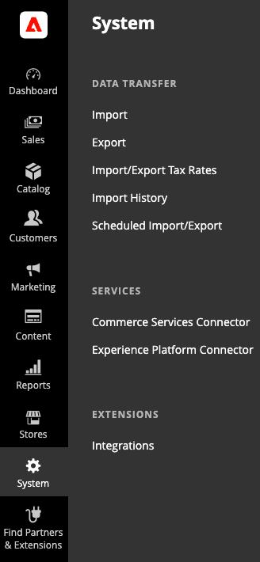

# Experience Platform-anslutning - översikt

Med Experience Platform-anslutningstillägget kan Adobe Commerce handlare skicka data till Adobe Experience Platform så att andra Adobe Experience Cloud-produkter, som Adobe Analytics och Adobe Target, kan använda dessa Commerce-data. Genom att ansluta era Commerce-data till andra produkter i Adobe Experience Cloud kan ni utföra uppgifter, till exempel analysera användarbeteenden på er webbplats, utföra AB-tester och skapa personaliserade kampanjer.

[Storefront-händelser](events.md) fånga kundinteraktioner, som `View Page`, `View Product`, `Add to Cart`och så vidare. Insamlade data innehåller inte personligt identifierbar information. Alla användaridentifierare, som cookie-ID:n och IP-adresser, är strikt anonymiserade. [Läs mer](https://www.adobe.com/privacy/experience-cloud.html).

Kopplingen Experience Platform visas i Commerce Admin under **System** > Tjänster > **Experience Platform Connector**.

## Förutsättningar {#prereqs}

För att kunna använda Experience Platform-kontakten måste du ha följande:

- Adobe Commerce 2.4.3 eller senare
- Adobe ID och organisations-ID
- Tillstånd till andra Adobe DX-produkter

## Inledande steg

1. [Installera](install.md) Experience Platform-kontakten.
1. [Logga in](https://helpx.adobe.com/manage-account/using/access-adobe-id-account.html) till ditt Adobe-konto och [visa](https://experienceleague.adobe.com/docs/core-services/interface/administration/organizations.html?lang=en#concept_EA8AEE5B02CF46ACBDAD6A8508646255) ditt företags-ID. Organisations-ID är det ID som är kopplat till ditt tilldelade Experience Cloud-företag. Detta ID är en 24 tecken lång alfanumerisk sträng, följt av (och måste innehålla) `@AdobeOrg`.
1. [Anslut](connect-data.md) din Adobe Commerce-instans till Adobe Experience Platform.
1. [Skapa eller uppdatera](update-xdm.md) XDM-schemat med handelsspecifika fältgrupper.
1. [Skapa ett datastream](https://experienceleague.adobe.com/docs/experience-platform/edge/datastreams/overview.html?lang=en) och välj det XDM-schema som innehåller de handelsspecifika fältgrupperna.
1. (Valfritt) [Ladda upp kundprofiler](profile.md) till Adobe Experience Platform så att butiksdata kan tillskrivas specifika kunder för att förbättra deras shoppingupplevelse.

## Målgrupp

Den här guiden är avsedd för Adobe Commerce-handlare som vill koppla sina Adobe Commerce-butiksdata till andra Adobe DX-produkter.

### Stöd för PWA Studio

Se [PWA Studio](https://developer.adobe.com/commerce/pwa-studio/integrations/adobe-commerce/aep/) dokumentation om hur du använder Experience Platform-kontakten i en PWA Studio storefront.

### AEM {#aem-support}

Se [AEM](https://experienceleague.adobe.com/docs/experience-manager-cloud-service/content/content-and-commerce/integrations/aep.html) dokumentation som visar hur du skickar händelsedata för butiker från en AEM produktsida till Experience Platform med CIF-anslutningen Experience Platform.

Om du behöver information eller har frågor som inte ingår i den här handboken använder du följande resurser:

- [Hjälpcenter](https://experienceleague.adobe.com/docs/commerce-knowledge-base/kb/overview.html){target=&quot;_blank&quot;}
- [Supportärenden](https://experienceleague.adobe.com/docs/commerce-knowledge-base/kb/help-center-guide/magento-help-center-user-guide.html#submit-ticket){target=&quot;_blank&quot;} - Skicka in en biljett för att få ytterligare hjälp.
