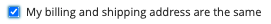

# Felsökning [!DNL Express Checkout] för Adobe Commerce

>[!IMPORTANT]
>
> Den här funktionen är endast avsedd för användare av tidig Adobe-programvara (EAP) och är ännu inte tillgänglig för alla kunder. För närvarande begränsat till amerikanska kunder. Kontakta Adobe Commerce Support för hjälp och frågor.

Använd följande felsökningsmetoder för att lösa dessa specifika problem.

## Felaktiga dispositionsnycklar

Om följande felmeddelande visas har du fel Composer-tangenter:

```terminal
Could not find a matching version of package magento/express-checkout. Check the package spelling, your version constraint and that the package is available in a stability which matches your minimum-stability (RC).
```

Kontrollera att dispositionsnycklarna är länkade till det Magento-ID som användes vid registreringen av Express Checkout.

Så här ser du vilka dispositionsnycklar som är konfigurerade:

1. Hitta platsen för `auth.json` fil:

   ```bash
   composer config --global home
   ```

1. Visa `auth.json` fil:

   ```bash
   cat /path/to/auth.json
   ```

1. Se [vilka tangenter som är kopplade till ditt Magento-ID](https://devdocs.magento.com/guides/v2.4/install-gde/prereq/connect-auth.html).

## Minsta stabilitet i `composer.json` är inställt på stabil

Om följande felmeddelande visas har du fel Composer-tangenter:

```terminal
Could not find a matching version of package magento/express-checkout. Check the package spelling, your version constraint and that the package is available in a stability which matches your minimum-stability (stable).
```

Ange lägsta stabilitet till `RC` i `composer.json` -fil.

## Det finns inte tillräckligt med minne för PHP

Om följande felmeddelande visas har du inte tillräckligt med minne för PHP:

```terminal
Fatal error: Allowed memory size of 2146435072 bytes exhausted (tried to allocate 4096 bytes) in phar:///usr/local/bin/composer/src/Composer/DependencyResolver/RuleWatchGraph.php on line 52
```

[Öka minnesgränsen](https://devdocs.magento.com/cloud/project/magento-app-php-ini.html#increase-php-memory-limit) för PHP i din miljö i `php.ini`.

Du kan också ange minnesgränsen med det här kommandot: `php -d memory_limit=-1 [path to composer]/composer require magento/express-checkout`.

Exempel:

```bash
php -d memory_limit=-1 vendor/bin/composer require magento/express-checkout
```

## Ogiltig leveransadress

Det finns ett känt problem med [!DNL Express Checkout].

När standardleveransadressen inte är giltig dirigeras kunden till leveransadresssteget. Endast giltiga leveransadresser visas i butiken.

>[!WARNING]
>
> om det inte finns några giltiga leveransadresser, kan kunden inte se någon tillgänglig leveransadress.

Se [leveransinformation](../express-checkout/shipping-details.md) för mer information.

## Lägg till gatuadressrader med en ny leveransadress

Det finns ett känt problem med [!DNL Express Checkout].

När du [logga in med ett bolt-konto](https://help.bolt.com/shoppers/guides/checkout/log-in/) Du kan lägga till en ny leveransadress med en begränsning på 4 rader per gatuadress.

Adobe Commerce kan vanligtvis konfigureras för att stödja upp till 20 gatuadressrader.

## Kryssruta `enable terms and conditions` visas inte korrekt

Det finns ett känt problem med [!DNL Express Checkout].

När du aktiverar `Enable terms and conditions` kryssrutan i Admin och logga in med [!DNL Bolt] konto, `Enable terms and conditions` kryssrutan visas inte under utcheckningen. Se [logga in](https://help.bolt.com/shoppers/account/login-dashboard/) [!DNL Bolt] sida för mer information.

Se [villkor](https://docs.magento.com/user-guide/sales/terms-and-conditions.html) om du vill ha mer information om Admin-konfigurationen.

## Oväntat beteende när `Display Billing Address On` är inställd på `payment page`

Det finns ett känt problem med [!DNL Express Checkout].

Om du anger `Display Billing Address On` parameter till `payment page` och [logga in med ett bolt-konto](https://help.bolt.com/shoppers/guides/checkout/log-in/) när du markerar `My billing and shipping address are the same` kryssruta:



Skärmar med alternativknappar `use existing card`.

Se [Utcheckning](https://docs.magento.com/user-guide/configuration/sales/checkout.html) om du vill ha mer information om `Display Billing Address On` parameter.

## Översätta [!DNL Express Checkout] extension

Med Adobe Commerce kan ni lokalisera er butik i flera regioner och på flera marknader. Du kan till och med lokalisera felmeddelanden i administrationsvyn.

Se [översätta och lokalisera](https://devdocs.magento.com/guides/v2.4/frontend-dev-guide/translations/xlate.html) för mer information.

## Få hjälp

Kontakta Adobe Commerce Support om du behöver hjälp.
