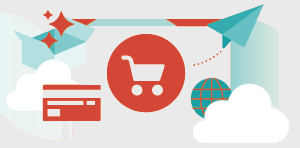

# <!-- use banner as heading --> {#documentation}

Adobe tillhandahåller en samling tjänster som hjälper handlarna att stödja nyckelkomponenterna i sin verksamhet.

## Tillgängliga tjänster

<table>
<tr>
   <td valign="top">
       
    
<a href="https://experienceleague.adobe.com/docs/commerce-merchant-services/product-recommendations/overview.html">
    <strong>[!DNL Product Recommendations]</strong></a>
    

    
(endast Adobe Commerce) <em>Lägg till AI-anpassade rekommendationer baserade på kundbeteende, populära trender, produktlikhet med mera.</em>

     
  </td>
  <td valign="top">
      
    

    <a href="https://experienceleague.adobe.com/docs/commerce-merchant-services/live-search/overview.html"><strong>[!DNL Live Search]</strong></a>
    

    
(endast Adobe Commerce) <em>Implementera detta AI-baserade sökverktyg som ger smartare, snabbare och relevanta resultat för B2C-kunder.</em>

     
  </td>
</tr>
<tr>
  <td valign="top">
    
    

    <a href="https://experienceleague.adobe.com/docs/commerce-merchant-services/payment-services/guide-overview.html"><strong>[!DNL Payment Services]</strong></a>
    

    <em>Öka kundnöjdheten genom att enkelt erbjuda olika betalningsmetoder, inklusive räntefria betalningar, och en enda vy över betalningshantering, beställningar och fakturor direkt på Admin Dashboard.</em>
     
  </td>
  <td valign="top">
    
    
<a href="https://experienceleague.adobe.com/docs/commerce-merchant-services/store-fulfillment/guide-overview.html">
    <strong>[!DNL Store Fulfillment]</strong></a>
    

    
(endast Adobe Commerce) <em>Leverera en överlägsen köp på webben, få en bättre kundupplevelse i butik (BOPIS) och maximera butikspersonalens produktivitet genom att tillhandahålla ett smidigt arbetsflöde för leverans i alla kanaler som aktiveras via en mobil enhet.</em>

     
  </td>
  </tr>
  <tr>
   <td valign="top">
    
    

    <a href="https://experienceleague.adobe.com/docs/commerce-channels/channel-manager/guide-overview.html"><strong>[!DNL Channel Manager]</strong></a>
    

    <em>Öka försäljningen, nå nya kunder, effektivisera försäljningen och spara tid genom att integrera en Adobe Commerce- eller Magento Open Source-produktkatalog med Walmart Marketplace. Gör det möjligt för butiksadministratörer och driftspersonal att hantera Walmart Marketplace-försäljning, lager och produktpriser sömlöst från Commerce-miljön.</em>
     
  </td>
    <td valign="top">
       
    
<a href="https://experienceleague.adobe.com/docs/commerce-channels/amazon/guide-overview.html">
    <strong>[!DNL Amazon Sales Channel]</strong></a>
    

    
<em>Integrera butikerna med världens största globala shoppingplats. Den här tjänsten möjliggör för Amazon att sälja genom att ansluta Commerce till ditt Amazon Seller Central-konto och erbjuda både automatisering och synkronisering av katalog- och orderdata. Hantera alla Amazon-listor fullständigt, implementera enkla eller intelligenta prisregler och underhålla order och lager via en enda Commerce Dashboard.</em>

     
  </td>
</tr>
</table>

## Anslut till tjänster

The [Commerce Services Connector](saas.md) innehåller integreringen för din Adobe Commerce- eller Magento Open Source-instans med en API-nyckel och en privat nyckel. För datatjänster (endast Adobe Commerce) kan du även ange datautrymme i konfigurationen.

## Katalogtjänst

Katalogtjänsten tillhandahåller skrivskyddade katalogdata som snabbt och fullständigt återger produktrelaterat innehåll i butiken, inklusive produktinformationssidor och produktlistsidor. Det ger kunderna en optimerad produktupplevelse och ger bättre prestanda, bättre skalbarhet och ökad konverteringsgrad.

## Nyheter

Följande objekt har nyligen ändrats i dokumentationen:

* *Betalningstjänster*—Instruktioner för [ladda ned tillägget](https://experienceleague.adobe.com/docs/commerce-merchant-services/payment-services/get-started/install.html#download-the-extension), förbättrade arbetsflödet för [anslutning till Commerce Services Connector](https://experienceleague.adobe.com/docs/commerce-merchant-services/payment-services/get-started/connect.html)och [tillagd information](https://experienceleague.adobe.com/docs/commerce-merchant-services/payment-services/get-started/connect.html) till avsnittet Anslut till tjänsten så att användaren kan avgöra om deras tjänster redan är anslutna (och vad som ska göras om de inte är det).
* Ute nu!—[Katalogtjänst](https://experienceleague.adobe.com/docs/commerce-merchant-services/catalog-service/overview.html) för Adobe Commerce
* *Live Search*—Ny information har lagts till i [Installera Live Search](https://experienceleague.adobe.com/docs/commerce-merchant-services/live-search/onboard/install.html) och [Översikt över introduktion](https://experienceleague.adobe.com/docs/commerce-merchant-services/live-search/onboard/onboarding-overview.html) ämnen om sökmotorn OpenSearch som ingår i nya moduler (för tillgänglighet i Adobe Commerce v2.4.6).
* *Experience Platform Connector*—Ett ämne har lagts till [om att använda taggar](https://experienceleague.adobe.com/docs/commerce-merchant-services/experience-platform-connector/event-forwarding/using-tags.html) och ett ämne [om hur du överför en kundprofil](https://experienceleague.adobe.com/docs/commerce-merchant-services/experience-platform-connector/fundamentals/profile.html) ämnen som förklarar hur du skapar profiler och använder AEP-taggen.
* *Snabb utcheckning*—Förbättrat [Onboarding-ämne](https://experienceleague.adobe.com/docs/commerce-merchant-services/quick-checkout/getting-started/onboarding.html) genom att ändra ordningsföljd och inkludera de senaste produktändringarna i administratörsgränssnittet.
* *Betalningstjänster*—[Apple Pay ute nu](https://experienceleague.adobe.com/docs/commerce-merchant-services/payment-services/payments-options.html#apple-pay-button) inom betaltjänster.
* *Experience Platform Connector*—En ny har lagts till [ämne om att uppdatera XDM-schemat](https://experienceleague.adobe.com/docs/commerce-merchant-services/experience-platform-connector/fundamentals/update-xdm.html) med Adobe Commerce-specifika fältnamn.
