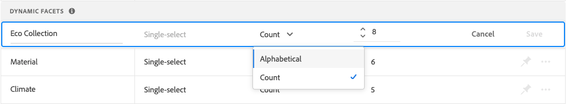

# Hantera ansikten

Följ de här instruktionerna för att uppdatera egenskaperna för befintliga aspekter eller ändra deras presentation i butiken.

## Konfigurera grupperingar av prisfaktorer

Se [Inställningar](settings.md) för att konfigurera prisfaktablad för intervall och grupperingar.

## Redigera fasett

1. Hitta den fasett du vill redigera.
1. Om det finns många aspekter i listan anger du *Filtrera efter* till något av följande:

   * Fastnålade
   * Dynamisk

   Om du vill veta mer går du till [Fasetttyper](facets-type.md).

   

1. Om du vill redigera ansiktsegenskaperna klickar du på **Mer** (...).
1. Klicka **Redigera**

   

1. Gör något av följande om du vill redigera ansiktsetiketten:

   * För [!DNL Commerce] storefront, redigera [attributetikett](https://docs.magento.com/user-guide/stores/attributes-product.html).
   * För en headless-implementering klickar du på värdet i den första kolumnen och redigerar texten efter behov.

   

1. (Endast Headless) Om du vill ändra metoden som används för att sortera fasvärden klickar du på värdet i *Sorteringstyp* och välj något av följande:

   * Alfabetiskt
   * Antal

   

1. I **Maxvärde** anger du det maximala antalet (från 0 till 10) av ansiktsfiltervärden som ska visas i storefront.
1. När du är klar klickar du på **Spara**.
Ändringarna visas inte i butiken förrän de har publicerats.

## Fäst/ta bort fasett

Fäststiftet ändrar färg när det klickas och används för att flytta ansiktet till antingen *Fasta ansikten* eller *Dynamiska ansikten* -avsnitt.

1. Så här fäster du en fasett högst upp i *Filter* söker du efter aspekten i listan *Dynamiska ansikten* och klicka på det grå stiftet ().
Fäststiftet blir blått och ansiktet flyttas till *Fasta ansikten* -avsnitt.
1. Om du vill ta bort en fasett hittar du den i *Fasta ansikten* och klicka på det blå stiftet ().
Fäststiftet blir grått och ansiktet flyttas till *Dynamiska ansikten* -avsnitt.

   

## Flytta fäst fasett

Du kan ändra ordningen på fästa ansikten genom att flytta raden till en annan position. Fästade ansikten har en *Flytta* ikon () i början av raden. Till skillnad från fästa ansikten kan dynamiska ansikten inte flyttas.

1. Hitta aspekten i dialogrutan *Fasta ansikten* i listan.
1. Använd **Flytta** () för att dra raden till en ny plats i *Fasta ansikten* -avsnitt.
När ändringarna har publicerats visas de omordnade ansiktena i butiken *Filter* lista.

## Ta bort fasett

1. Hitta aspekten i listan och klicka på **Mer** (...).
1. Klicka **Ta bort**.
1. När du uppmanas att bekräfta klickar du på **Ta bort fasett**.
Fasetten tas bort från butiken när ändringarna har publicerats.

## Publicera ändringar

1. Om du vill uppdatera butiken med dina ändringar klickar du på **Publicera ändringar**.
1. Vänta i ungefär 15 minuter tills uppdateringarna visas i din butik.
