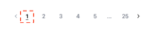
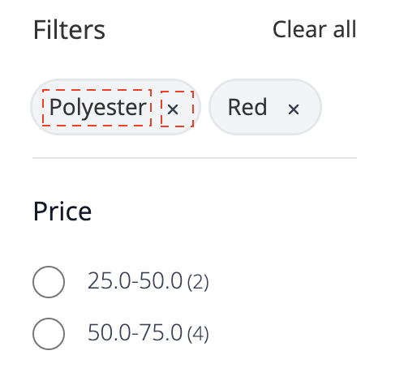

# Sidwidget för produktlista

The [!DNL Live Search Product Listing Page Widget] (PLP) använder Commerce Services-plattformen för att tillhandahålla en utförlig, sökbar och faktabaserad produktlistsida. I det här avsnittet beskrivs hur du aktiverar och formaterar PLP-widgeten.

## Aktivera PLP-widgeten

När [!DNL Live Search] tjänsten är installerad, standardsökfunktionen konverteras till [!DNL Live Search] automatiskt.

The [!DNL Live Search] PLP-widgeten är aktiverad som standard för nya installationer. Om du uppgraderar [!DNL Live Search] och PLP-widgeten redan har stängts av, kommer att förbli så.

>[!IMPORTANT]
>
>När [!DNL Live Search Product Listing Page Widget] är aktiverat går det inte att ändra sorteringsordningen på en produktlistsida.

## Inaktivera PLP-widgeten

Så här inaktiverar du PLP-widgeten:

1. Gå till **Lager** > Inställningar > **Konfiguration** > **[!DNL Live Search]** > **Adobe Storefront-funktioner** och ange **Aktivera widgetar för produktlistor** till &quot;Nej&quot;.
1. Välj **Spara konfiguration** för att spara inställningen.

## Widgetfunktioner

PLP-widgeten innehåller en rad funktioner som förväntas på en sökbar produktsida. Bland dessa finns:

* Filtrera efter attribut
* Stöd för färgrutor
* Lägg till i kundvagnen
* Stöd för flera språk
* Prisreglage

Mer information om hur du anpassar PLP-widgeten för att hantera ovanstående funktioner finns i `storefront-product-listing-page` Viktigt i följande [repo](https://github.com/adobe/storefront-product-listing-page/).

## Exempel på format

Du kan anpassa utseende och känsla för PLP-widgeten så att den passar din webbplats med [CSS](https://developer.adobe.com/commerce/frontend-core/guide/css/).

>[!NOTE]
>
>Element med anpassade klasser inom ett Adobe Commerce-tema ärvs inte. Dessa element måste ha en specifik klass som mål för att matcha de anpassade klasserna. De primära åtgärdsklasserna fungerar inte med en widgetknapp.
>Allmänna målelement inom CSS ärvs. `button` används för widgetknappar.

De markerade diven innehåller målklassen `ds-sdk-product-item__product-name`.


Anpassa produktnamnet genom att lägga till en regel som gör dem till stora bokstäver.

```css
.ds-sdk-product-item__product-name {
 text-transform: uppercase;
}
```


## CSS-klasser

### Produktlista

* `.ds-sdk-product-list`: Yttre div
* `.ds-sdk-product-list__grid`: Inre div


#### Sidnumrering av produktlista

* `.ds-plp-pagination`


* `.ds-plp-pagination_item`


* `.ds-plp-pagination_item--current`



### Widgetar

* `.ds-widgets`: Yttre div
* `.ds-widgets__actions`: Inre div på vänster sida
* `.ds-widgets__results`: Inre div på höger sida


### Sortera-listrutan

* `.ds-sdk-sort-dropdown`


* `.ds-sdk-sort-dropdown__button`


* `.ds-sdk-sort-dropdown__items`


* `.ds-sdk-sort-dropdown__items--item`


* `.ds-sdk-sort-dropdown__items--item-selected`


* `.ds-sdk-sort-dropdown__items--item-active`


### Fasetter

* `.ds-plp-facets`
* `.ds-plp-facets__header`
* `.ds-plp-facets__header_title`
* `.ds-plp-facets__header__clear-all`

{width="350"}

* `.ds-plp-facets__pills`
* `.ds-sdk-pill`

{width="350"}

* `.ds-sdk-pill__label`
* `.ds-sdk-pill__cta`

{width="350"}

* `.ds-plp-facets__list`

{width="350"}

* `.ds-sdk-input`
* `.ds-sdk-input__label`
* `.ds-sdk-product-item__product-swatch-group`
* `ds-sdk-product-item__product-swatch-item`
* `.ds-sdk-input_fieldset_show-more`


* `.ds-sdk-labelled-input`


* `.ds-sdk-labelled-input__input`
* `.ds-sdk-labelled-input__label`


### Produktartikel

* `.ds-sdk-product-item`
* `.ds-sdk-product-item__image`
* `.ds-sdk-product-item__product-name`
* `.ds-sdk-product-item__product-options`
* `.ds-sdk-product-price`
   * `.ds-sdk-product-price--no-discount`
   * `.ds-sdk-product-price--grouped`
   * `.ds-sdk-product-price--bundle`
   * `.ds-sdk-product-price--discount`


### Läser in

* `.ds-sdk-loading`
* `.ds-sdk-loading__spinner`
* `.ds-sdk-loading__spinner-label`


