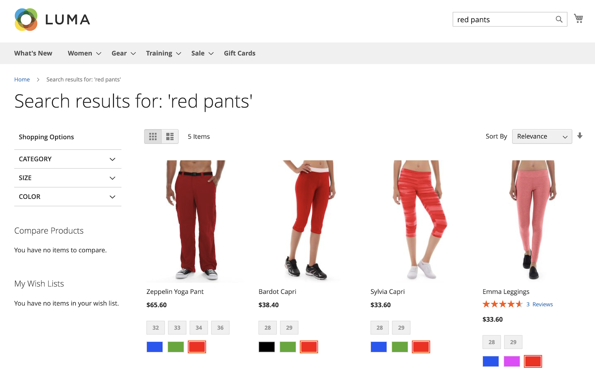

# Snabbdemo

Med fokus på hastighet, relevans och användarvänlighet [!DNL Live Search] förändrar spelreglerna för både kunder och handlare. Följ med för en snabb genomgång av [!DNL Live Search] från butiken.

## Sök medan du skriver

[!DNL Live Search] svarar med föreslagna produkter och en miniatyrbild av de bästa sökresultaten i en [poppor](storefront-popover.md) som kunder skriver frågor i [Sök](https://docs.magento.com/user-guide/catalog/search-quick.html) box. The [produktinformation](https://docs.magento.com/user-guide/quick-tour/product-page.html) visas när kunderna klickar på en föreslagen eller aktuell produkt. A _Visa alla_ -länken i portörens sidfot visar sökresultatsidan.

[!DNL Live Search] returnerar &quot;sökning när du skriver&quot; resultat för en fråga med två eller flera tecken. För en partiell matchning är det maximala antalet tecken per ord 20. Det går inte att konfigurera antalet tecken i frågan. Följande fält ingår i porten: `name`, `sku`och `category_ids`.

## Visa alla sökresultat

Om du vill visa en lista över alla produkter som returneras av frågan&quot;Sök när du skriver&quot; klickar du på _Visa alla_ i mapoverens sidfot.

## Filtrerad sökning med fack

Vid filtrerad sökning används flera dimensioner av attributvärden, eller [facets](facets.md), som sökvillkor. Urvalet av filter definieras av handlaren och ändras beroende på vilka produkter som returneras, med de mest använda ansiktena fästa överst i listan.

## Synonymer

[Synonymer](synonyms.md) utöka räckvidden och skärpa fokus på frågor genom att inkludera ord som kunderna kan använda som skiljer sig från dem i katalogen. Du kan finjustera synonymordboken för att hålla kunderna engagerade och på köpvägen.

## Marknadsföringsregler

Merchandising [regler](rules.md) forma shoppingupplevelsen med&quot;if-then&quot;-satser som lägger till logik och händelser att söka efter. Du kan enkelt beskära eller begrava produkter för en kampanj, säsong eller annan tidsperiod.
