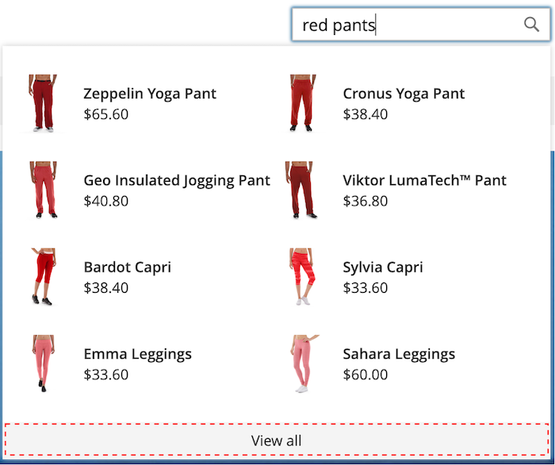

# Formatera popoposerelement

The [storefront poser](storefront-popover.md) visar alltid produkten `name` och `price`och valet av fält kan inte konfigureras. Leveranselement kan emellertid formateras med CSS-klasser. Följande deklarationer ändrar t.ex. bakgrundsfärgen för povisningsbehållaren och sidfoten.

```css
.livesearch.popover-container {
    background-color: lavender;
}

.livesearch.view-all-footer {
    background-color: magenta;
}
```

## Synlighet för behållare

Den överordnade komponenten för `.livesearch.popover-container` är `.search-autocomplete`.  The `.active` -klassen anger behållarens synlighet. The `.active` -klassen läggs till villkorligt när providern är öppen.

```css
.search-autocomplete.active   /* visible */
.search-autocomplete          /* not visible */
```

Mer information om hur du formaterar butikselement finns i [CSS (Cascading Style Sheets)](https://devdocs.magento.com/guides/v2.4/frontend-dev-guide/css-topics/css-overview.html) i [Utvecklarhandbok för Edge](https://devdocs.magento.com/guides/v2.4/frontend-dev-guide/bk-frontend-dev-guide.html).

## Klassväljare

Följande klassväljare kan användas för att formatera behållar-, förslag- och produktelementen i povern.

* `.livesearch.popover-container`
* `.livesearch.view-all-footer`
* `.livesearch.suggestions-container`
* `.livesearch.suggestions-header`
* `.livesearch.suggestion`
* `.livesearch.products-container`
* `.livesearch.product-result`
* `.livesearch.product-name`
* `.livesearch.product-price`

### Väljare för behållarklass

`.livesearch.popover-container`


`.livesearch.view-all-footer`



### Väljare för förslagsklass

`.livesearch.suggestions-container`


`.livesearch.suggestions-header`


`.livesearch.suggestion`


### Produktklassväljare

`.livesearch.products-container`


`.livesearch.product-result`


`.livesearch.product-name`


`.livesearch.product-price`


## Arbeta med ett ändrat tema {#working-with-modified-theme}

Den här storefront-pekaren kan användas med en anpassad [tema](https://devdocs.magento.com/guides/v2.3/frontend-dev-guide/themes/theme-overview.html) som ärver de nödvändiga filerna från *Luma*. The `top.search` -block i `header-wrapper` i `Magento_Search` får inte ändras.

```html
<referenceContainer name="header-wrapper">
   <block class="Magento\Framework\View\Element\Template" name="top.search" as="topSearch" template="Magento_Search::form.mini.phtml">
      <arguments>
         <argument name="configProvider" xsi:type="object">Magento\Search\ViewModel\ConfigProvider</argument>
      </arguments>
   </block>
</referenceContainer>
```

## Inaktivera popovern

Så här inaktiverar du pekaren och återställer standarden [Snabbsökning](https://docs.magento.com/user-guide/catalog/search-quick.html) anger du följande kommando:

```bash
bin/magento module:disable Magento_LiveSearchStorefrontPopover
```
