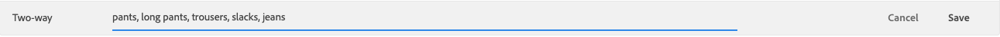

# Hantera synonymer

Följ dessa anvisningar för att hantera befintliga [!DNL Live Search] [synonymer](synonyms.md).

## Sök synonym

För att göra det enkelt att hitta en synonym kan du filtrera listan efter typ och söka efter nyckelord eller expansionsterm.  Dessa metoder kan användas var för sig eller tillsammans.

1. Om du vill filtrera listan anger du **Typ** till något av följande:

   * Alla
   * Envägs
   * Tvåvägs

1. Om du vill söka efter ett nyckelord eller en expansionsterm anger du minst tre tecken i **Sök efter** box.

## Redigera synonym

1. Hitta den synonym som du vill redigera och klicka på **Mer** (...).

1. Klicka **Redigera**.
Nyckelordet är den första termen i listan, och varje term avgränsas med kommatecken. Nyckelord och expanderingsvillkor kan uppdateras, men synonymens typ kan inte ändras.
1. Klicka på det objekt som du vill redigera. Uppdatera sedan texten efter behov.

   

1. När du är klar klickar du på **Spara**.

## Ta bort synonym

1. Sök efter den synonym som du vill ta bort i listan och klicka på **Mer** (...).
1. Klicka **Ta bort**.
1. Klicka på **Ta bort synonym** för att bekräfta.

## Publicera ändringar

För att slutföra processen måste de sparade ändringarna publiceras i butiken. Det kan ta upp till två timmar innan uppdateringarna är klara.

1. Klicka **Publicera ändringar**.
1. Leta efter meddelandet högst upp på sidan som bekräftar att dina ändringar har publicerats.
