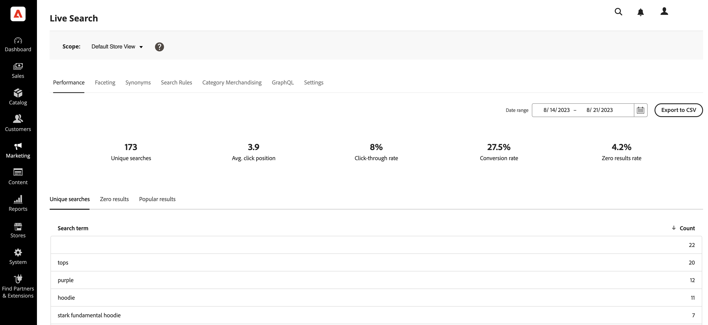

# Arbetsyta

På arbetsytan kan du konfigurera, hantera och övervaka prestanda för [!DNL Live Search]. Menyn längst upp ger åtkomst till verktygen i varje funktionsområde.  De tillgängliga funktionerna återspeglar det aktuella menyvalet.

## Ange omfånget

Inledningsvis [omfång](https://experienceleague.adobe.com/docs/commerce-admin/start/setup/websites-stores-views.html#scope-settings) alla [!DNL Live Search] inställningarna är inställda på `Default Store View`. Om [!DNL Commerce] installationen innehåller flera butiksvyer, uppsättning **Omfång** till [butiksvy](https://experienceleague.adobe.com/docs/commerce-admin/start/setup/websites-stores-views.html) där dina facet-inställningar gäller.

## Menyalternativ

| Alternativ | Beskrivning |
|--- |--- |
| [Prestanda](performance.md) | Instrumentpanelen ger dig insikt i hur produktsökningar fungerar. |
| [Motsatthet](facets.md) | Högpresterande filtrering som använder flera dimensioner av attributvärden för att förfina sökvillkoren. |
| [Synonymer](synonyms.md) | Utvidga sökräckvidden och inkludera ord som kunderna kan använda för att hitta produkter som skiljer sig från dem i katalogen. |
| [Search Merchandising](rules.md) | Formge sökupplevelsen med logiska regler som utlöser schemalagda åtgärder. Öka, begrava, fästa eller dölj produkter för att kalibrera sökresultaten efter era affärsmål. |
| [Kategorimarknadsföring](category-merch.md) | Använd regler och intelligent marknadsföring på kategorinivå. |
| [GraphQL](graphql.md) | Utvecklare som är inloggade i administratören för din butik kan skapa och testa frågor med faktiska katalogdata. Om du vill veta mer går du till [GraphQL - översikt](https://developer.adobe.com/commerce/webapi/graphql/) i [!DNL Live Search] dokumentation för utvecklare. |
| [Inställningar](settings.md) | Bestäm hur prisfaktavärden grupperas efter prisintervall i butiken och ställ in indexeringsspråket. |
