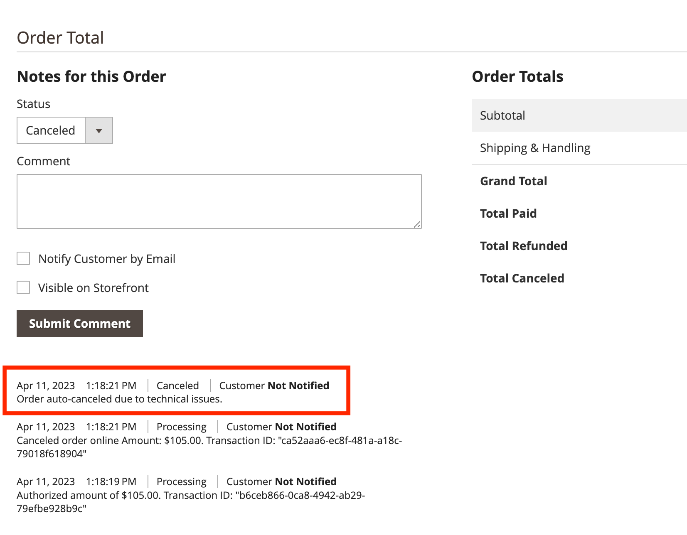

# Utcheckning

Du kan konfigurera utcheckning för Adobe Commerce [!DNL Payment Services] så att de passar era kunder. Funktioner som [automatisk annullering av order](#order-auto-voided-if-error) och [kreditkortsvalv](#credit-card-vaulting) säkerställa att era kunder får en smidig användarupplevelse.

## Beställningen annulleras automatiskt om fel uppstår

Om ett fel inträffar under utcheckningen, [!DNL Payment Services] automatiskt annullerar/annullerar ordningen.

Ett felmeddelande visas på utcheckningssidan för kunden. Meddelandet kan variera.

{width="600" zoomable="yes"}

En kommentar om den annullerade ordern visas också i administratören för en specifik [beställa](https://experienceleague.adobe.com/docs/commerce-admin/stores-sales/order-management/orders/orders.html?lang=en).

{width="600" zoomable="yes"}

Om en kund får auktorisering för en order, men ordern inte har skapats och konverterats till en `Capture`, annulleras ordern automatiskt. Denna process garanterar att ingen kredit reserveras på kundens kreditkort och undviker den betalaravgift som uppstår när auktorisationen annulleras vid slutet av den vanliga 29-dagarsperioden.

>[!NOTE]
>
>Automatisk annullering av order sker endast när kunden använder en betalningsmetod som är inställd på `Authorize` läge, inte `Authorize and Capture` läge.

## Utcheckning från produktsida

När en kund checkar ut direkt från produktsidan använder du PayPal eller [!DNL Pay Later] är det bara den artikel som finns på den aktuella produktsidan som köps. Artiklar som redan finns i kundens kundvagn läggs inte till i utcheckningsflödet och köps inte.

Med den här funktionen kan kunden snabbt köpa det objekt de för närvarande visar, samtidigt som artiklar som tidigare lagts till i kundvagnen behålls.
Om kunden avbryter beställningen läggs artikeln på den aktuella produktsidan till i kundvagnen.

När en kund går in i utcheckningsflödet från produktsidan förenklas utcheckningssidan - vyn visar endast orderrelaterade data och alternativ.

## Kreditkortssäkringar

Köpare kan vault - eller&quot;save&quot; - deras kreditkortsinformation för framtida inköp på webbplatsnivå (vilken butik som helst på samma handlares konto).

Se [Kreditkortssäkringar](vaulting.md) för mer information
