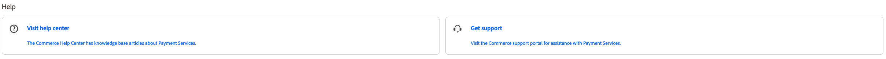

# [!DNL Payment Services] Guide overview

Den här handboken är avsedd för administratörer av [!DNL Adobe Commerce] och [!DNL Magento Open Source]. Den innehåller detaljerad information om installation och introduktion av [!DNL Payment Services]samt konfiguration och hantering av tjänsterna. Det förutsätter en grundläggande förståelse för kärnhandelns konfiguration och funktioner.

>[!TIP]
>
>Mer information om hur du får hjälp med betaltjänster finns i [Support](#support).

[!DNL Payment Services] har två områden för administratörer:

* Administratören: Använd det här området för att komma åt konfigurationsgränssnittet och rapporter.
* Kommandoradsgränssnittet (CLI): Använd det här verktyget för att utföra installations- och backend-konfigurationsuppgifter.

Den här guiden täcker:

* Alla [!DNL Payment Services]-specifika uppgifter som utförs i administratören.
* Alla [!DNL Payment Services]-specifika uppgifter som utförs med kommandoraden i Commerce

Den här guiden täcker inte kärnfunktionerna i [!DNL Adobe Commerce] och [!DNL Magento Open Source].

## Ytterligare dokumentation

| Guide | Beskrivning |
|------ | ----------- |
| [[!DNL Adobe Commerce] 2.4 Användarhandbok](https://experienceleague.adobe.com/docs/commerce-admin/user-guides/home.html) | Handlingar för båda [!DNL Adobe Commerce] och [!DNL Magento Open Source] |
| [[!DNL Adobe Commerce] 2.4 Utvecklarhandbok](https://developer.adobe.com/commerce/docs) | Dokumentation för utvecklare som används för att skapa och anpassa [!DNL Adobe Commerce] eller [!DNL Magento Open Source] |

## Support

Om du behöver information eller har frågor som inte behandlas i den här handboken kan du använda följande resurser i ditt hem:

* [Hjälpcenter](https://experienceleague.adobe.com/docs/commerce-knowledge-base/kb/overview.html)—Sök efter [!DNL Payment Services]-relaterade felsökningsartiklar i kunskapsbasen.
* [Supportärenden](https://experienceleague.adobe.com/docs/commerce-knowledge-base/kb/help-center-guide/magento-help-center-user-guide.html#submit-ticket)—Skicka in en biljett för att få ytterligare hjälp.
