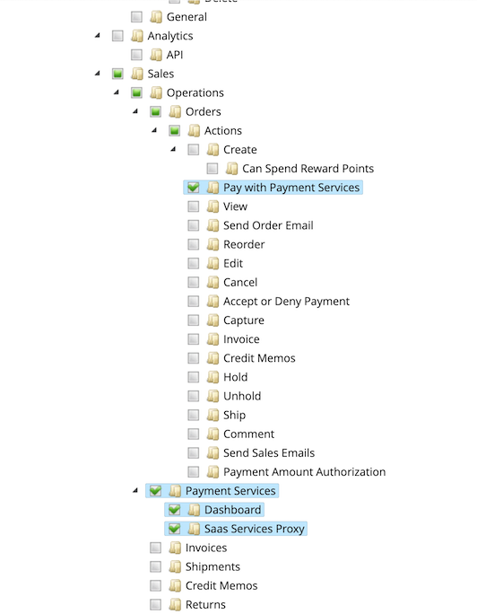

# Inställningar

Du kan anpassa [!DNL Payment Services] efter dina behov med praktiska inställningar i [!DNL Payment Services] Hem.

Konfigurera [!DNL Payment Services] for [!DNL Adobe Commerce] och [!DNL Magento Open Source] klicka **[!UICONTROL Settings]**. Dessa konfigurationsalternativ gäller endast för miljön som anges i _[!UICONTROL Payment mode]_fält för[_ Allmänt _konfigurationsalternativ](#configure-general-settings).

Information om konfiguration för flera lagringsplatser eller äldre finns i [Konfigurera i administratören](configure-admin.md).

## Konfigurera allmänna inställningar

The [!UICONTROL General] Med inställningar kan du aktivera eller inaktivera Betalningstjänster som betalningsmetod och lägga till information i kundtransaktioner för att markera eller prefix en webbplats eller butiksvy med anpassad information.

### Aktivera betaltjänster

Du kan aktivera [!DNL Payment Services] för din webbplats och aktivera antingen sandlådetestning eller direktbetalningar.

1. På _Administratör_ sidebar, gå till **[!UICONTROL Sales]** > **[!UICONTROL Payment Services]**.

   {width="400" zoomable="yes"}

1. Klicka på **[!UICONTROL Settings]**. Se [Introduktion till [!DNL Payment Services] Startsida](payments-home.md) för mer information.

   The _[!UICONTROL General]_-avsnittet innehåller inställningar som används för att aktivera [!DNL Payment Services] som betalningsmetod.

1. Aktivera [!DNL Payment Services] som betalningsmetod för din butik, i _[!UICONTROL General]_sektion, växla **[!UICONTROL Enable Payment Services as payment method]**till `Yes`.

1. Om du fortfarande testar [!DNL Payment Services] för din butik, **Betalningsläge** till `Sandbox`. Om du är redo att aktivera livebetalningar anger du det till `Production`.

   >[!NOTE]
   >
   >Dina _[!UICONTROL Sandbox Merchant ID]_och_[!UICONTROL Production Merchant ID]_ genereras automatiskt och finns i respektive fält när du är klar med introduktionen av sandlådan och/eller produktionen.

1. Klicka på **[!UICONTROL Save]**.

   Om du försöker navigera bort från den här vyn utan att spara dina ändringar visas en modal som uppmanar dig att ignorera ändringar, fortsätta redigera eller spara ändringar.

1. Navigera till **[!UICONTROL System]** > **[!UICONTROL Cache Management]** och klicka **[!UICONTROL Flush Cache]** om du vill uppdatera alla ogiltiga cacheminnen.

Du kan nu fortsätta att ändra standardinställningarna för [betalningsalternativ](#configure-payment-options) funktioner och butiksvisning.

### Lägg till mjuk beskrivning

Du kan lägga till en [!UICONTROL Soft Descriptor] till din eller dina webbplatser eller enskilda butiksvyer. Mjuka beskrivningar visas på kontoutdrag för kundtransaktioner. Om du t.ex. har flera butiker/varumärken/kataloger kan du enkelt skilja mellan dem genom att lägga till egen text i [!UICONTROL Soft Descriptor] fält.

1. På _Administratör_ sidebar, gå till **[!UICONTROL Sales]** > **[!UICONTROL Payment Services]**.
1. Klicka på **[!UICONTROL Settings]**. Se [Introduktion till [!DNL Payment Services] Startsida](payments-home.md) för mer information.
1. Välj webbplatsen eller butiksvyn i **[!UICONTROL Scope]** som du vill skapa en mjuk beskrivning för. För den första konfigurationen låter du den vara som **[!UICONTROL Default]** för att ange standardvärdet.
1. Lägg till egen text (upp till 22 tecken) i textfältet och ersätt `Custom descriptor`.
1. Klicka på **[!UICONTROL Save]**.
1. Så här skapar du en annan mjuk beskrivning än den som är konfigurerad som standard för en webbplats- eller butiksvy:
   1. Välj webbplatsen eller butiksvyn i **[!UICONTROL Scope]** som du vill skapa en mjuk beskrivning för.
   1. Växla _av_ **[!UICONTROL Use website]** (eller **[!UICONTROL Use default]**, beroende på vilket omfång du har valt).
   1. Lägg till egen text i textfältet.
   1. Klicka på **[!UICONTROL Save]**.
1. Aktivera för en webbplats eller butik genom att visa standardprogrambeskrivningen _eller_ den mjuka beskrivning som används för den överordnade webbplatsen:
   1. Välj webbplatsen eller butiksvyn i **[!UICONTROL Scope]** som du vill aktivera en befintlig programbeskrivningsfil för.
   1. Växla _på_ **[!UICONTROL Use website]** (eller **[!UICONTROL Use default]**, beroende på vilket omfång du har valt).
   1. Klicka på **[!UICONTROL Save]**.

   Om du försöker navigera bort från den här vyn utan att spara dina ändringar visas en modal som uppmanar dig att ignorera ändringar, fortsätta redigera eller spara ändringar.

### Konfigurationsalternativ

| Fält | Omfång | Beskrivning |
|---|---|---|
| [!UICONTROL Enable] | webbplats | Aktivera eller inaktivera [!DNL Payment Services] för er webbplats. Alternativ: [!UICONTROL Off] / [!UICONTROL On] |
| [!UICONTROL Payment mode] | butiksvy | Ange metod, eller miljö, för din butik. Alternativ: [!UICONTROL Sandbox] / [!UICONTROL Production] |
| [!UICONTROL Sandbox Merchant ID] | butiksvy | Ditt handlar-ID för sandlådan, som genereras automatiskt vid introduktion av sandlådor. |
| [!UICONTROL Production Merchant ID] | butiksvy | Ditt handlar-ID för produktion, som genereras automatiskt när sandlådan introduceras. |
| [!UICONTROL Soft Descriptor] | webbplats eller butiksvy | Lägg till en mjuk beskrivning till webbplatserna och butiksvyn för att lägga till information till kundtransaktioner som avgränsar varumärken, butiker eller produktrader. The [!UICONTROL Use website] växlingsknappen använder alla mjuka beskrivningar som har lagts till på webbplatsnivå. The [!UICONTROL Use default] växlingsknappen använder alla mjuka beskrivningar som har lagts till som standard. |

## Konfigurera betalningsalternativ

Nu när du har aktiverat [!UICONTROL Payment Services] för din webbplats kan du ändra standardinställningarna för betalningsfunktioner och butiksvisning.

1. På _Administratör_ sidebar, gå till **[!UICONTROL Sales]** > **[!UICONTROL Payment Services]**.
1. Klicka på **[!UICONTROL Settings]**. Se [Introduktion till [!DNL Payment Services] Startsida](payments-home.md) för mer information.
1. Konfigurera betalningsalternativ för [kreditkort](#credit-card-fields), [betalningsknappar](#payment-buttons)och [knappstil](#button-style), enligt följande avsnitt.

### Kreditkortsfält

The _[!UICONTROL Credit Card Fields]_är ett enkelt och säkert alternativ för utcheckning av betalningsmetoder för kreditkort och betalkort.

Se [Betalningsalternativ](payments-options.md#credit-card-fields) för mer information.

1. På _Administratör_ sidebar, gå till **[!UICONTROL Sales]** > **[!UICONTROL Payment Services]**.
1. Välj butiksvyn i **[!UICONTROL Scope]** som du vill aktivera en betalningsmetod för.
1. I **[!UICONTROL Credit card fields]** redigerar du värdet i **[!UICONTROL Checkout title]** om du vill ändra namnet på betalningsmetoden som visas under utcheckningen.
1. Till [ange betalningsåtgärd](production.md#set-payment-services-as-payment-method), växla **[!UICONTROL Payment action]** till `Authorize` eller `Authorize and Capture`.
1. Om du vill prioritera en betalningsmetod på utcheckningssidan anger du en `Numeric Only` värdet i **[!UICONTROL Sort order]** fält.
1. Aktivera [Säker 3DS-autentisering](security.md#3ds) (`Off` som standard) **[!UICONTROL 3DS Secure authentication]** väljare till `Always` eller `When required`.
1. Om du vill aktivera eller inaktivera kreditkortsfält på kassasidan växlar du **[!UICONTROL Show on checkout page]** väljare.
1. Aktivera eller inaktivera [kortvault](#card-vaulting), växlar **[!UICONTROL Vault enabled]** väljare.
1. Aktivera eller inaktivera [Valda betalningsmetoder i Admin](#card-vaulting) (för att handlare ska kunna slutföra beställningar för kunder i administratören med hjälp av sina betalningsmetoder) kan du växla till **[!UICONTROL Show vaulted methods in Admin]** väljare.
1. Aktivera eller inaktivera felsökningsläget genom att växla **[!UICONTROL Debug Mode]** väljare.
1. Klicka på **[!UICONTROL Save]**.

   Om du försöker navigera bort från den här vyn utan att spara dina ändringar visas en modal som uppmanar dig att ignorera ändringar, fortsätta redigera eller spara ändringar.

1. [Töm cachen](#flush-the-cache).

#### Konfigurationsalternativ

| Fält | Omfång | Beskrivning |
|---|---|---|
| [!UICONTROL Title] | butiksvy | Lägg till texten som ska visas som rubrik för det här betalningsalternativet i vyn Betalningsmetod vid utcheckning. Alternativ: [!UICONTROL text field] |
| [!UICONTROL Payment Action] | webbplats | The [betalningsåtgärd](https://docs.magento.com/user-guide/configuration/sales/payment-methods.html#payment-actions){target="_blank"} för den angivna betalningsmetoden. Alternativ: [!UICONTROL Authorize] / [!UICONTROL Authorize and Capture] |
| [!UICONTROL Sort order] | butiksvy | Sorteringsordningen för den angivna betalningsmetoden på utcheckningssidan. `Numeric Only` value |
| [!UICONTROL 3DS Secure authentication] | webbplats | Aktivera eller inaktivera [Säker 3DS-autentisering](security.md#3ds). Alternativ: [!UICONTROL Always] / [!UICONTROL When Required] / [!UICONTROL Off] |
| [!UICONTROL Show on checkout page] | webbplats | Aktivera eller inaktivera kreditkortsfält som ska visas på utcheckningssidan. Alternativ: [!UICONTROL Off] / [!UICONTROL On] |
| [!UICONTROL Vault enabled] | butiksvy | Aktivera eller inaktivera [kreditkortsvalv](vaulting.md). Alternativ: [!UICONTROL Off] / [!UICONTROL On] |
| [!UICONTROL Show vaulted payment methods in Admin] | butiksvy | Aktivera eller inaktivera möjligheten för handlare att slutföra beställningar för kunder i administratören [med en betalningsmetod som är skyddad](vaulting.md). Alternativ: [!UICONTROL Off] / [!UICONTROL On] |
| [!UICONTROL Debug Mode] | webbplats | Aktivera eller inaktivera felsökningsläget. Alternativ: [!UICONTROL Off] / [!UICONTROL On] |

### Apple Pay

The [!UICONTROL Apple Pay] knappbetalningsalternativ ger dig möjlighet att [!UICONTROL Apple Pay] betalningsknappen i utcheckningen av din butik från webbläsaren Safari (för upp till 99 domäner per handlarkonto).

Du kan bara använda Apple Pay om du är klar [Apple Betala självregistrering via Paypal](https://developer.paypal.com/docs/checkout/apm/apple-pay/#register-your-live-domain) och sedan [konfigurera Apple Pay](settings.md/#payment-buttons) för butikerna. Se [Betalningsalternativ](payments-options.md#apple-pay-button) för mer information.

Du kan aktivera och konfigurera [!UICONTROL Apple Pay] knappbetalningsalternativ:

1. På _Administratör_ sidebar, gå till **[!UICONTROL Sales]** > **[!UICONTROL Payment Services]**.
1. Välj butiksvyn i **[!UICONTROL Scope]** som du vill aktivera en betalningsmetod för.
1. I **[!UICONTROL Apple Pay]** redigerar du värdet i _[!UICONTROL Checkout title]_om du vill ändra namnet på betalningsmetoden som visas under utcheckningen.
1. Till [ange betalningsåtgärd](production.md#set-payment-services-as-payment-method), växla **[!UICONTROL Payment action]** till `Authorize` eller `Authorize and Capture`.
1. Om du vill aktivera eller inaktivera Apple Pay på utcheckningssidan växlar du **[!UICONTROL Show Apple Pay on checkout page]** väljare.
1. Om du vill aktivera eller inaktivera Apple Pay på produktinformationssidan växlar du **[!UICONTROL Show Apple Pay on product detail page]** väljare.
1. Om du vill aktivera eller inaktivera Apple Pay i minikundvagnen kan du växla till **[!UICONTROL Show Apple Pay on the mini cart preview]** väljare.
1. Om du vill aktivera eller inaktivera Apple Pay på kundvagnssidan växlar du **[!UICONTROL Show Apple Pay on cart page]** väljare.
1. Aktivera eller inaktivera felsökningsläget genom att växla **[!UICONTROL Debug Mode]** väljare.
1. Klicka på **[!UICONTROL Save]**.

   Om du försöker navigera bort från den här vyn utan att spara dina ändringar visas en modal som uppmanar dig att ignorera ändringar, fortsätta redigera eller spara ändringar.

1. [Töm cachen](#flush-the-cache).

#### Konfigurationsalternativ

| Fält | Omfång | Beskrivning |
|---|---|---|
| [!UICONTROL Checkout title] | butiksvy | Lägg till texten som ska visas som rubrik för det här betalningsalternativet i vyn Betalningsmetod vid utcheckning. Alternativ: [!UICONTROL text field] |
| [!UICONTROL Payment Action] | webbplats | The [betalningsåtgärd](https://docs.magento.com/user-guide/configuration/sales/payment-methods.html#payment-actions) för den angivna betalningsmetoden. Alternativ: [!UICONTROL Authorize] / [!UICONTROL Authorize and Capture] |
| [!UICONTROL Show on checkout page] | webbplats | Aktivera eller inaktivera Apple Pay-knappen för att visa på utcheckningssidan. Alternativ: [!UICONTROL Off] / [!UICONTROL On] |
| [!UICONTROL Show on checkout page] | webbplats | Aktivera eller inaktivera Apple Pay-knappen så att den visas på produktinformationssidan. Alternativ: [!UICONTROL Off] / [!UICONTROL On] |
| [!UICONTROL Show on mini cart preview] | webbplats | Aktivera eller inaktivera Apple Pay-knappen för att visa i minikundvagnen. Alternativ: [!UICONTROL Off] / [!UICONTROL On] |
| [!UICONTROL Show on cart page] | webbplats | Aktivera eller inaktivera Apple Pay-knappen för att visa i kundvagnen. Alternativ: [!UICONTROL Off] / [!UICONTROL On] |
| [!UICONTROL Debug Mode] | webbplats | Aktivera eller inaktivera felsökningsläget. Alternativ: [!UICONTROL Off] / [!UICONTROL On] |

### Betalningsknappar

The [!DNL PayPal payment buttons] betalningsalternativ ger en enkel, snabb och säker utcheckningsprocess för kunden. Se [Betalningsalternativ](payments-options.md#paypal-smart-buttons) för mer information.

Du kan aktivera och konfigurera betalningsalternativen för betalningsknapparna i PayPal:

1. Välj butiksvyn i **[!UICONTROL Scope]** som du vill aktivera en betalningsmetod för.
1. Om du vill ändra namnet på betalningsmetoden så som visas vid utcheckning redigerar du värdet i **[!UICONTROL Checkout Title]** fält.
1. Till [ange betalningsåtgärd](production.md#set-payment-services-as-payment-method), växla **[!UICONTROL Payment action]** till `Authorize` eller `Authorize and Capture`.
1. Om du vill prioritera en betalningsmetod på utcheckningssidan anger du en `Numeric Only` värdet i **[!UICONTROL Sort order]** fält.
1. Använd växlingsväljarna för att aktivera eller inaktivera [!DNL PayPal smart button] visningsfunktioner:

   - **[!UICONTROL Show PayPal buttons on product checkout page]**
   - **[!UICONTROL Show PayPal buttons on product detail page]**
   - **[!UICONTROL Show PayPal buttons in mini-cart preview]**
   - **[!UICONTROL Show PayPal buttons on cart page]**
   - **[!UICONTROL Show PayPal Pay Later button]**
   - **[!UICONTROL Show PayPal Pay Later message]**
   - **[!UICONTROL Show Venmo button]**
   - **[!UICONTROL Show Apple Pay button]**
   - **[!UICONTROL Show PayPal Credit and Debit Card button]**

     >[!NOTE]
     >
     > Så här använder du Apple Betala [måste ha ett Apple sandlådeprovarkonto](https://developer.apple.com/apple-pay/sandbox-testing/#create-a-sandbox-tester-account) (komplett med falska kreditkort och faktureringsuppgifter) för att testa det. När du är redo att använda Apple Pay i sandlådan _eller_ produktionsläge, efter slutförande av [testning och validering](test-validate.md#test-in-sandbox-environment), slutförd [självregistrering med [!DNL Apple Pay]](https://developer.paypal.com/docs/checkout/apm/apple-pay/#register-your-live-domain) (_Registrera din livedomän_ endast ) och [konfigurera den för dina butiker i [!DNL Payment Services]](settings.md#payment-buttons).

     När du aktiverar/inaktiverar synlighet för betalningsknappar eller meddelandet PayPal Pay Later (Betala senare) visas en visuell förhandsvisning av den konfigurationen längst ned på sidan Inställningar.

1. Aktivera felsökningsläget genom att växla **[!UICONTROL Debug Mode]** väljare.
1. Klicka på **[!UICONTROL Save]**.

   Om du försöker navigera bort från den här vyn utan att spara dina ändringar visas en modal som uppmanar dig att ignorera ändringar, fortsätta redigera eller spara ändringar.

1. [Töm cachen](#flush-the-cache).

#### Konfigurationsalternativ

| Fält | Omfång | Beskrivning |
|---|---|---|
| [!UICONTROL Title] | butiksvy | Lägg till texten som ska visas som rubrik för det här betalningsalternativet i vyn Betalningsmetod vid utcheckning. Alternativ: textfält |
| [!UICONTROL Payment Action] | webbplats | The [betalningsåtgärd](https://docs.magento.com/user-guide/configuration/sales/payment-methods.html#payment-actions){target="_blank"} för den angivna betalningsmetoden. Alternativ: [!UICONTROL Authorize] / [!UICONTROL Authorize and Capture] |
| [!UICONTROL Sort order] | butiksvy | Sorteringsordningen för den angivna betalningsmetoden på utcheckningssidan. `Numeric Only` value |
| [!UICONTROL Show PayPal buttons on checkout page] | butiksvy | Aktivera eller inaktivera [!DNL PayPal payment buttons] på utcheckningssidan. Alternativ: [!UICONTROL  Yes] / [!UICONTROL No] |
| [!UICONTROL Show PayPal buttons on product detail page] | butiksvy | Aktivera eller inaktivera [!DNL PayPal payment buttons] på produktinformationssidan. Alternativ: [!UICONTROL  Yes] / [!UICONTROL No] |
| [!UICONTROL Show PayPal buttons in mini-cart preview] | butiksvy | Aktivera eller inaktivera [!DNL PayPal payment buttons] i minikundvagnen. Alternativ: [!UICONTROL Off] / [!UICONTROL On] |
| [!UICONTROL Show PayPal buttons on cart page] | butiksvy | Aktivera eller inaktivera [!DNL PayPal payment buttons] på kundvagnssidan. Alternativ: [!UICONTROL Off] / [!UICONTROL On] |
| [!UICONTROL Show PayPal Pay Later button] | butiksvy | Aktivera eller inaktivera utseendet på betalningsalternativ vid ett senare tillfälle där betalningsknappar visas. Alternativ: [!UICONTROL Off] / [!UICONTROL On] |
| [!UICONTROL Show PayPal Pay Later Message] | webbplats | Aktivera eller inaktivera meddelandet Betala senare i kundvagnen, på produktsidan, i minikundvagnen och under kassaflödet. Alternativ: [!UICONTROL Off] / [!UICONTROL On] |
| [!UICONTROL Show Venmo button] | butiksvy | Aktivera eller inaktivera betalalternativet Venmo där betalningsknappar visas. Alternativ: [!UICONTROL Off] / [!UICONTROL On] |
| [!UICONTROL Show Apple Pay button] | butiksvy | Aktivera eller inaktivera betalningsalternativet Apple Pay där betalningsknappar visas. Alternativ: [!UICONTROL Off] / [!UICONTROL On] |
| [!UICONTROL Show PayPal Credit and Debit card button] | butiksvy | Aktivera eller inaktivera alternativet för kredit- och betalkortsbetalning där betalningsknappar visas. Alternativ: [!UICONTROL Off] / [!UICONTROL On] |
| [!UICONTROL Debug Mode] | webbplats | Aktivera eller inaktivera felsökningsläget. Alternativ: [!UICONTROL Off] / [!UICONTROL On] |

### Knappformat

Du kan även konfigurera _[!UICONTROL Button style]_alternativ för betalningsknapparna:

1. Ändra **[!UICONTROL Layout]**, markera `Vertical` eller `Horizontal`.

   >[!NOTE]
   >
   > Om knappformatet är konfigurerat som `Horizontal` och din butik är konfigurerad för att visa flera betalningsknappar kan du bara se två knappar som visas på produktsidan, utcheckningssidan, minivagnen och en knapp som visas i kundvagnen.

1. Aktivera tagline i en vågrät layout genom att växla **[!UICONTROL Show tagline]** väljare.
1. Ändra **[!UICONTROL Color]** väljer du önskat färgalternativ.
1. Ändra **[!UICONTROL Shape]**, markera `Pill` eller `Rectangle`.
1. Aktivera knapphöjdsväljaren genom att växla **[!UICONTROL Responsive button height]** väljare.
1. Ändra **[!UICONTROL Label]** väljer du önskat etikettalternativ.

   När du ändrar konfigurationsalternativen för layout, färg, form, höjd och etikett visas en visuell förhandsvisning av konfigurationen längst ned på sidan Inställningar. I bilden nedan visas **[!UICONTROL Shape]** är inställd på _Rektangel_ och **[!UICONTROL Label]** är inställd på _PayPal (rekommenderas)_.

   ![[!DNL PayPal payment buttons] alternativ](assets/payment-buttons.png){width="400" zoomable="yes"}

1. Klicka på **[!UICONTROL Save]**.

   Om du försöker navigera bort från den här vyn utan att spara dina ändringar visas en modal som uppmanar dig att ignorera ändringar, fortsätta redigera eller spara ändringar.

1. [Töm cachen](#flush-the-cache).

Du kan konfigurera format för betalningsknappar [i äldre konfiguration i Admin](configure-admin.md#configure-paypal-smart-buttons) eller här inne [!DNL Payment Services Home]. Se [PayPals stilguide för knappar](https://developer.paypal.com/docs/checkout/standard/customize/buttons-style-guide/) för mer information om hur du formaterar betalningsknappar för PayPal.

#### Konfigurationsalternativ

| Fält | Omfång | Beskrivning |
|--- |--- |--- |
| [!UICONTROL Layout] | Butiksvy | Definiera layoutformat för betalningsknappar. Alternativ: [!UICONTROL Vertical] / [!UICONTROL Horizontal] |
| [!UICONTROL Tagline] | Butiksvy | Aktivera/inaktivera tagline. Alternativ: [!UICONTROL Off] / [!UICONTROL On] |
| [!UICONTROL Color] | Butiksvy | Definiera färg på betalningsknapparna. Alternativ: [!UICONTROL Blue] / [!UICONTROL Gold] / [!UICONTROL Silver] / [!UICONTROL White] / [!UICONTROL Black] |
| [!UICONTROL Shape] | Butiksvy | Definiera formen på betalningsknapparna. Alternativ: [!UICONTROL Rectangular] / [!UICONTROL Pill] |
| [!UICONTROL Responsive Button Height] | Butiksvy | Definierar om betalningsknappar använder en standardhöjd. Alternativ: [!UICONTROL Off] / [!UICONTROL On] |
| [!UICONTROL Height] | Butiksvy | Definiera höjden på betalningsknapparna. Standardvärde: ingen |
| [!UICONTROL Label] | Butiksvy | Definiera etikett som visas i betalningsknapparna. Alternativ: [!UICONTROL PayPal] / [!UICONTROL Checkout] / [!UICONTROL Buynow] / [!UICONTROL Pay] / [!UICONTROL Installment] |

## Konfigurera roller

Om du vill försäkra dig om att administratörsanvändare kan skapa och hantera order i Commerce Admin aktiverar du [!DNL Payment Services]-specifika resurser för användarroller.

Se [Användarroller](https://experienceleague.adobe.com/docs/commerce-admin/systems/user-accounts/permissions-user-roles.html) om du vill lära dig hur du hanterar roller.

När du tilldelar resurser till rollen måste du välja:

- **Betala med[!DNL Payment Services]**- Den här resursen ser till att när du skapar en beställning i administratören, [!DNL Payment Services] kreditkort är tillgängliga som betalningsmetod. Om du väljer **Åtgärder** överordnad resurs, den här resursen kommer också att väljas.
- **[!DNL Payment Services]**—Den här resursen innehåller **Kontrollpanel** och **SaaS-tjänstproxy** , som också måste väljas. De ser till att [!DNL Payment Services] visas i _Försäljning_ -menyn.

  {width="400" zoomable="yes"}

## Töm cachen

Om du ändrar konfigurationen i _Inställningar_, till exempel genom att växla knapparna Apple Pay, Venmo eller PayPal PayLater, kan du manuellt tömma cachen så att butiken visar de senaste konfigurationerna.

1. På _Administratör_ sidebar, gå till **[!UICONTROL System]** > **[!UICONTROL Cache Management]**.
1. Klicka **[!UICONTROL Flush Cache]** om du vill uppdatera alla ogiltiga cacheminnen.

Om någon cache-typ i cacheminneshanteringstabellen har en `INVALIDATED` status, din butik kanske inte visar den senaste konfigurationen för det objektet. Töm cacheminnet för att uppdatera butiken så att den senaste konfigurationen visas.

För att säkerställa att butiken visar rätt konfiguration bör du regelbundet [tömma cachen](https://docs.magento.com/user-guide/system/cache-management.html).

## Kortsäkring

Du kan aktivera funktioner som gör att dina kunder kan vault - eller&quot;save&quot; - sina kreditkortsuppgifter i Mitt konto och använda dem för framtida inköp.

Du kan också använda kortvalsfunktionen i Admin för att slutföra efterföljande beställningar för befintliga kunder.

Aktivera eller inaktivera kortvalv i [Inställningar för kreditkortsfält](#credit-card-fields).

Se [Kreditkortssäkringar](vaulting.md) för mer information.

## 3DS

3DS skyddar kunder och handlare från bedräglig verksamhet i deras butiker och möjliggör efterlevnad av EU:s standarder.

Aktivera eller inaktivera 3DS i [Inställningar för kreditkortsfält](#credit-card-fields).

Se [3DS i säkerhet](security.md#3ds) för mer information.

## Använd flera PayPal-konton

I [!UICONTROL Payment Services]kan du använda flera PayPal-konton i **en** handelskonto på webbplatsnivå. Om du till exempel har en eller flera butiker i flera länder (som använder olika [valutor](https://docs.magento.com/user-guide/stores/currency.html)) eller vill använda Adobe Commerce för vissa delar av verksamheten, men inte _alla_ kan du konfigurera ditt handlarkonto så att du kan använda flera PayPal-konton.

Se [Plats, butik och visningsomfång](https://experienceleague.adobe.com/docs/commerce-admin/start/setup/websites-stores-views.html) för mer information om hierarkin för webbplatser, butiker och butiksvyer.

Säljaren kan skapa en ny [omfång](https://experienceleague.adobe.com/docs/commerce-admin/start/setup/websites-stores-views.html#scope-settings) för ert handlarkonto och lägg in ytterligare sajt med PayPal så att alla PayPal-knappar som du konfigurerar visas på din sajt. Kontakta din säljare för att få hjälp med att använda flera PayPal-konton för dina webbplatser.
