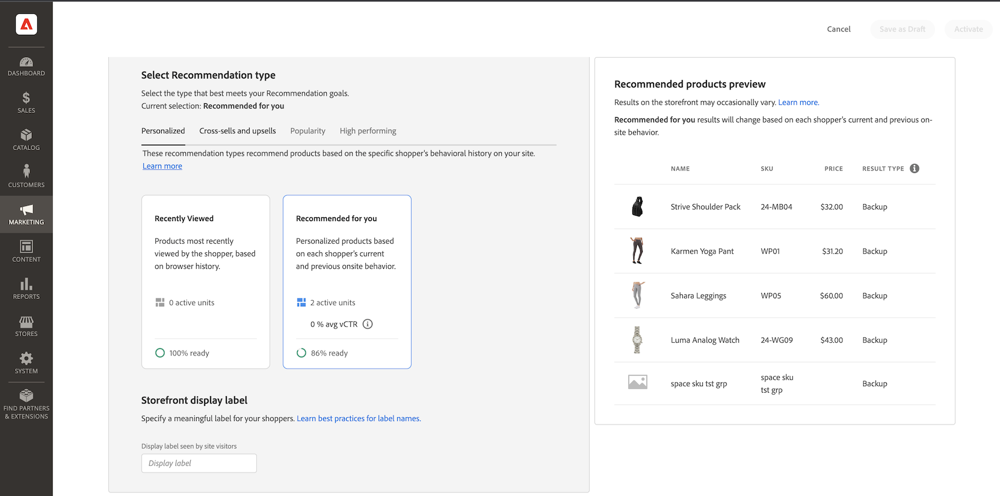

# Skapa ny rekommendation

När du skapar en rekommendation skapar du en _rekommendationsenhet_ som innehåller de rekommenderade _produktobjekten_.

_Rekommendationsenhet_

När du aktiverar rekommendationsenheten börjar Adobe Commerce [samla in data](workspace.md) för att mäta visningar, vyer, klick och så vidare. Tabellen [!DNL Product Recommendations] visar måtten för varje rekommendationsenhet så att du kan fatta välgrundade affärsbeslut.

1. Gå till **Marknadsföring** > _Kampanjer_ > **Produkt-Recommendations** på sidofältet _Admin_ för att visa arbetsytan för _Produkt-Recommendations_.

1. Ange [butiksvyn](https://experienceleague.adobe.com/docs/commerce-admin/start/setup/websites-stores-views.html#scope-settings) där du vill att rekommendationerna ska visas.

   >[!NOTE]
   >
   > Rekommendationsenheter för Page Builder måste skapas i standardbutiksvyn, men kan användas var som helst. Mer information om hur du skapar produktrekommendationer med Page Builder finns i [Lägg till innehåll - Recommendations](https://experienceleague.adobe.com/docs/commerce-admin/page-builder/add-content/recommendations.html).

1. Klicka på **Skapa rekommendation**.

1. I avsnittet _Namnge din rekommendation_ anger du ett beskrivande namn för intern referens, till exempel `Home page most popular`.

1. I avsnittet _Välj sidtyp_ väljer du den sida där du vill att rekommendationen ska visas bland följande alternativ:

   >[!NOTE]
   >
   > Produkt-Recommendations stöds inte på kundvagnssidan när din butik är konfigurerad att [visa kundvagnssidan omedelbart efter att en produkt lagts till i kundvagnen](https://experienceleague.adobe.com/docs/commerce-admin/stores-sales/point-of-purchase/cart/cart-configuration.html#redirect-to-cart).

   * Hemsida
   * Kategori
   * Produktinformation
   * Kundvagn
   * Bekräftelse
   * [Page Builder](https://experienceleague.adobe.com/docs/commerce-admin/page-builder/add-content/recommendations.html)

   Du kan skapa upp till fem aktiva rekommendationsenheter för varje sidtyp och upp till 25 för Page Builder. Sidtypen är nedtonad när gränsen nås.

   
   _Rekommendationsnamn och sidplacering_

1. I avsnittet _Välj rekommendationstyp_ anger du den [typ av rekommendation](type.md) som du vill ska visas på den valda sidan. För vissa sidor är [placeringen](placement.md) av rekommendationerna begränsad till vissa typer.

1. Ange den [etikett](placement.md#recommendation-labels) som är synlig för dina kunder, till exempel&quot;Top sellers&quot;, i avsnittet _Store-visningsrubrik_.

1. I avsnittet _Välj antal produkter_ använder du skjutreglaget för att ange hur många produkter du vill ska visas i rekommendationsenheten.

   Standardvärdet är `5`, men högst `20`.

1. I avsnittet _Välj placering_ anger du platsen där rekommendationsenheten ska visas på sidan.

   * Längst ned i huvudinnehållet
   * Överst i huvudinnehållet

1. (Valfritt) Om du vill ändra ordningen på rekommendationerna markerar du och flyttar raderna i tabellen _Välj position_ .

   I avsnittet _Välj position_ visas alla rekommendationer (om sådana finns) som har skapats för den valda sidtypen.

   
   _Rekommendationsordning på sidan_

1. (Valfritt) I avsnittet _Filter_ använder [du filter](filters.md) för att kontrollera vilka produkter som visas i rekommendationsenheten.

   
   _Rekommendationsproduktfilter_

1. När du är klar klickar du på något av följande:

   * **Spara som utkast** om du vill redigera rekommendationsenheten senare. Du kan inte ändra sidtypen eller rekommendationstypen för en rekommendationsenhet i ett utkastläge.

   * **Aktivera** om du vill aktivera rekommendationsenheten på din butik.

## Beredskapsindikatorer

Vissa rekommendationstyper använder beteendedata från dina kunder till [utbildningsmodeller för träning av maskiner](behavioral-data.md) för att skapa personaliserade rekommendationer.

Kräver endast katalogdata. Inga beteendedata behövs för dessa:

* _Mest gilla detta_
* _Senast visade_
* _Visuell likhet_

Baserat på de senaste sex månaderna av storefront beteendedata:

* _Visade det här, visade att_
* _Den här visades och_ köptes
* _Köpte det här, köpte det_
* _Rekommenderas för dig_

Popularitetsbaserade rekommendationstyper använder de sju sista dagarna av storefront-beteendedata:

* Mest visade
* Mest köpta
* Tillagd i kundvagnen
* Trender

Beredskapsindikatorvärdena förväntas fluktuera på grund av faktorer som katalogens totala storlek, volymen för produktinteraktionshändelser (vyer, läggs till i kundvagn, inköp) och den procentandel skus som registrerar dessa händelser inom ett visst tidsfönster enligt listan ovan. Vid högtrafik under högsäsong kan beredskapsindikatorerna till exempel visa högre värden än vid normal volym.

I avsnittet _Välj rekommendationstyp_ visas ett mått på beredskap för varje typ, så att du kan visualisera utbildningsförloppet för varje rekommendationstyp. Dessa beredskapsindikatorer beräknas utifrån några faktorer:

* Tillräcklig storlek för resultatuppsättning: Finns det tillräckligt många resultat som returneras i de flesta scenarier för att [rekommendationerna för säkerhetskopiering](behavioral-data.md#backuprecs) inte ska användas?

* Tillräcklig mängd resultat: Representerar de returnerade produkterna en mängd olika produkter från din katalog? Målet med den här faktorn är att undvika att en liten andel produkter är de enda objekt som rekommenderas på webbplatsen.

Baserat på ovanstående faktorer beräknas och visas ett beredskapsvärde. En rekommendationstyp anses vara redo att distribueras när dess beredskapsvärde är 75 % eller högre. En rekommendationstyp anses vara delvis klar när dess beredskap är minst 50 %. En rekommendationstyp anses inte redo att distribueras när dess beredskapsvärde är mindre än 50 %. Dessa är allmänna riktlinjer, men varje enskilt fall kan skilja sig åt beroende på vilken typ av insamlade data som beskrivs ovan.

_Rekommendationstyp_

>[!NOTE]
>
>Indikatorer kan aldrig nå 100 %.

## Förhandsgranska Recommendations {#preview}

Panelen _Rekommenderad produktförhandsvisning_ är alltid tillgänglig med ett urval produkter som kan visas i rekommendationsenheten när den distribueras till butiken.

Om du vill testa en rekommendation när du arbetar i en icke-produktionsmiljö kan du hämta rekommendationsdata från en [annan källa](settings.md). På så sätt kan handlare experimentera med regler och förhandsgranska rekommendationerna innan de distribuerar till produktionen.

| Fält | Beskrivning |
|---|---|
| Namn | Produktens namn. |
| SKU | Den lagerhållningsenhet som tilldelats produkten |
| Pris | Produktens pris. |
| Resultattyp | Primär - anger att det finns tillräckligt med utbildningsdata för att visa en rekommendation. Säkerhetskopiering - indikerar att det inte finns tillräckligt med utbildningsdata insamlade så en rekommendation för säkerhetskopiering används för att fylla platsen. Gå till [Beteendedata](behavioral-data.md) om du vill veta mer om maskininlärningsmodeller och rekommendationer för säkerhetskopiering. |

När du skapar rekommendationsenheten kan du experimentera med sidtyp, rekommendationstyp och filter för att få omedelbar feedback i realtid om de produkter som ska ingå. När du börjar förstå vilka produkter som visas kan du konfigurera rekommendationsenheten så att den uppfyller dina affärsbehov.

Adobe Commerce [filtrerar](filters.md) rekommendationer så att dubblettprodukter inte visas när flera rekommendationsenheter distribueras på en sida. Det innebär att de produkter som visas på förhandsvisningspanelen kan skilja sig från de som visas i butiken.

>[!NOTE]
>
> Du kan inte förhandsgranska rekommendationstypen `Recently viewed` eftersom data inte är tillgängliga i Admin.
