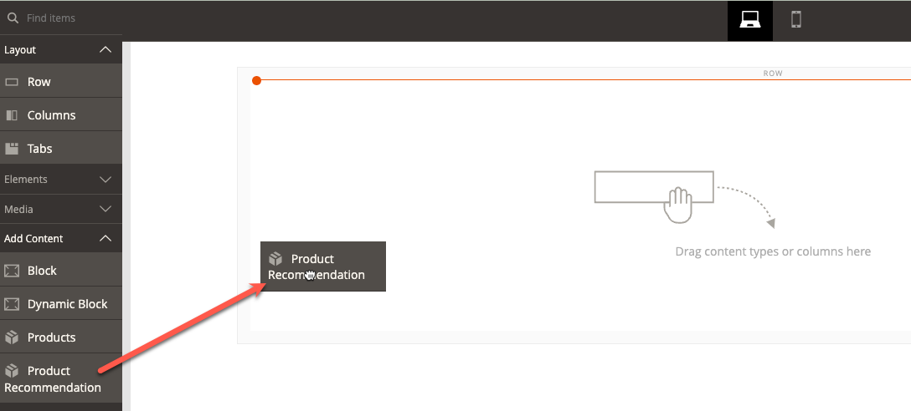

# [!DNL Page Builder] Integrering

Produkt-Recommendations kan integreras i allt innehåll i Page Builder som du publicerar på din webbplats.

>[!NOTE]
>
> Du kan ha upp till 25 rekommendationsenheter på en inbyggd Page Builder-sida. Sidor som inte är inbyggda i Page Builder kan ha upp till 5 rekommendationsenheter. Se [Skapa ny rekommendation](create.md) för mer information.

## Använda Product Recommendations med Page Builder-innehåll

1. Skapa en rekommendationsenhet i standardbutiksvyn för en webbplats. De måste skapas i standardbutiksvyn även om du tänker använda dem i olika butiksvyer.
1. I Page Builder väljer du produktwidgeten för Recommendations och placerar den på din webbplats.

1. Klicka **Redigera produktrekommendation**
1. Klicka **Välj**
1. Välj den rekommendationsenhet du skapat tidigare och klicka på **Lägg till markerade**

1. Gör andra ändringar i Page Builder-innehållet och spara ändringarna.

Vid återgivningstiden respekteras sidans innehåll och omfattning av rekommendationsenheten.
