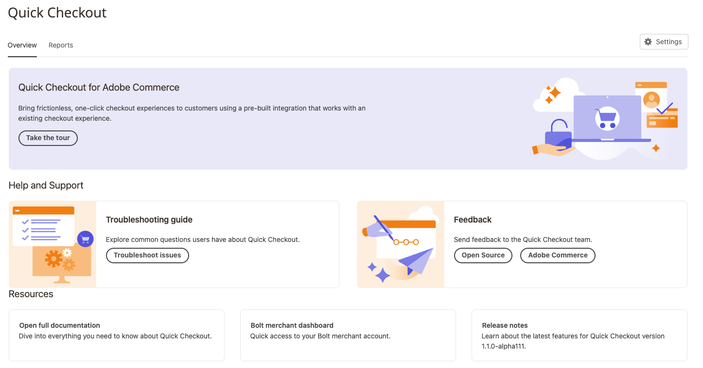

# Introduktion till [!DNL Quick Checkout] Admin Panel

[!DNL Quick Checkout] för Adobe Commerce och Magento Open Source har en administratörspanelvy med all nödvändig information för att konfigurera och använda tillägget.

1. På _Administratör_ sidebar, gå till **[!UICONTROL Sales]** > **[!UICONTROL Quick Checkout]**:
1. I den här vyn har du åtkomst till _Administratörspanelen_ översikt, _Resurs_ om [!DNL Quick Checkout], hämta _Hjälp och support_ eller konfigurera tillägget via _Inställningar_.

   {width="600" zoomable="yes"}

Kontrollera att användaren har rätt roller och behörigheter för [!DNL Quick Checkout] Administratörspanelen som ska visas. Se [Användarroller och behörigheter](../quick-checkout/user-roles-setup.md) för mer information.

Se [Onboarding](../quick-checkout/onboarding.md) om du vill ha mer information om hur du konfigurerar [!DNL Quick Checkout] för Adobe Commerce.

## Startsida

| Fält | Beskrivning |
|---|---|
| [!UICONTROL Overview] | På fliken Översikt visas alla resurser som du kan använda [!DNL Quick Checkout]. |
| [!UICONTROL Reports] | Fliken Rapporter innehåller omfattande [!DNL Quick Checkout] information. |

## Hjälp och support

| Fält | Beskrivning |
|---|---|
| [!UICONTROL Troubleshooting guide] | Adobe Commerce Help Center innehåller [!DNL Quick Checkout] felsöka artiklar. |
| [!UICONTROL Feedback] | Ge feedback till teamet. |

## Resurs

| Fält | Beskrivning |
|---|---|
| [!UICONTROL Open documentation] | Se de senaste dokumenten för [!DNL Quick Checkout]. |
| [!UICONTROL [!DNL Bolt] merchant dashboard] | Få åtkomst till dina [!DNL Bolt] handelskonto och kontrollpanel. |
| [!UICONTROL Release notes] | Läs om de senaste ändringarna i [!DNL Quick Checkout]. |

## Inställningar

Klicka på **[!UICONTROL Settings]** för att komma åt [!DNL Quick Checkout] konfiguration. Se [Administratörskonfiguration](onboarding.md#complete-admin-configuration) för mer information.
