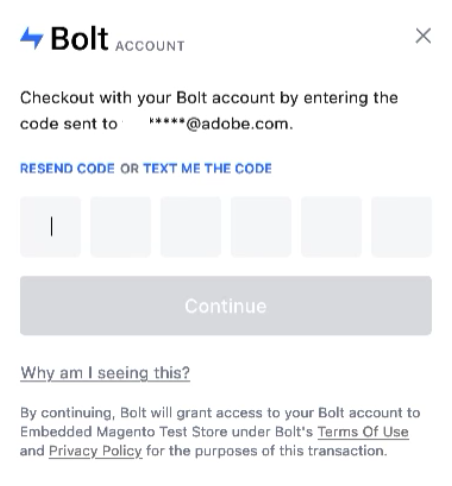

# [!DNL Quick Checkout] flöde

I det här avsnittet finns en översikt över den typiska utcheckningen med [!DNL Quick Checkout] för Adobe Commerce.

Slutförd [!DNL Quick Checkout] -flödet består av följande steg:

1. Öppna butiken och lägg till artiklar i kundvagnen.
1. Gå till kassan.

1. Ange en e-postadress som är kopplad till en [!DNL Bolt] konto.
1. Ange engångslösenordet som skickas till det [!DNL Bolt] kontots e-postadress eller telefonnummer.

1. När du är inloggad med din [!DNL Bolt] konto, checkout-information fylls i automatiskt:

   - Leveransinformation
   - Betalningssätt

   >[!NOTE]
   >
   > Du kan använda din befintliga plånboksinformation (adress eller kreditkortsinformation) även om dina utcheckningsuppgifter fylls i automatiskt.

1. Beställ.

The [!DNL Quick Checkout] är kompatibelt med andra Adobe Commerce-alternativ för utcheckning, som [presentkort](https://docs.magento.com/user-guide/catalog/product-gift-card.html) eller [rabattkoder](https://docs.magento.com/user-guide/marketing/price-rules-cart-coupon.html).

## [!DNL Quick Checkout] användningsfall

The [!DNL Quick Checkout] tillåter flera användningsfall under ett utcheckningsflöde:

- [Gästanvändare](../quick-checkout/checkout-bolt.md) med en registrerad eller ny [!DNL Bolt] konto.
- En befintlig [Adobe Commerce-användare](../quick-checkout/checkout-adobe-commerce.md) med eller utan registrering [!DNL Bolt] konto.

## Få hjälp

Kontakta Adobe Commerce Support via [Adobe Commerce Help Center](https://support.magento.com/hc/en-us/articles/360000913794-Adobe-Commerce-Help-Center-User-Guide) om du behöver hjälp.
