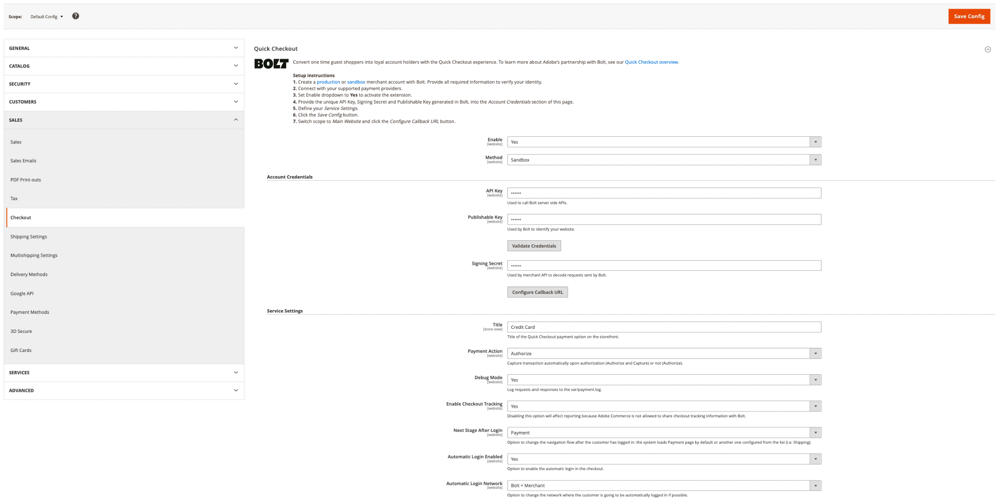

# [!DNL Quick Checkout] Inställningar

[!DNL Quick Checkout] för Adobe Commerce och Magento Open Source innehåller en konfigurationsvy med all nödvändig information för att konfigurera tillägget.

Så här kommer du åt konfigurationsinställningarna:

1. På _Administratör_ sidebar, gå till **Lager** > _Inställningar_ > **Konfiguration**.
1. Expandera på den vänstra panelen **Försäljning** och markera **Utcheckning**.

   {width="800" zoomable="yes"}

Se [Onboarding](../quick-checkout/onboarding.md) om du vill ha mer information om hur du konfigurerar [!DNL Quick Checkout] för Adobe Commerce.

## Aktivera tillägg

{width="500" zoomable="yes"}

| Fält | Omfång | Beskrivning |
|---|---|---|
| [!UICONTROL Enable] | webbplats | Aktivera eller inaktivera [!DNL Quick Checkout] för er webbplats. Alternativ: [!UICONTROL Yes] / [!UICONTROL No] |
| [!UICONTROL Method] | webbplats | Ange metod eller miljö för [!DNL Quick Checkout]. Alternativ: [!UICONTROL Sandbox] / [!UICONTROL Production] |

{style="table-layout:auto"}

## Kontoautentiseringsuppgifter

{width="500" zoomable="yes"}

| Fält | Omfång | Beskrivning |
|---|---|---|
| [!UICONTROL API key] | webbplats | En privat nyckel som används av bakänden för att interagera med [!DNL Bolt] API. |
| [!UICONTROL Publishable key] | webbplats | En tangent som används av den främre änden för att interagera med [!DNL Bolt] API. |
| [!UICONTROL Signing secret] | webbplats | Används för signaturverifiering på begäranden som tas emot från [!DNL Bolt]. |

{style="table-layout:auto"}

## Tjänstinställningar

{width="500" zoomable="yes"}

| Fält | Omfång | Beskrivning |
|---|---|---|
| [!UICONTROL Title] | butiksvy | Lägg till texten som ska visas som rubrik för det här betalningsalternativet i vyn Betalningsmetod vid utcheckning. Alternativ: [!UICONTROL text field] |
| [!UICONTROL Payment Action] | webbplats | The [betalningsåtgärd](https://docs.magento.com/user-guide/configuration/sales/payment-methods.html#payment-actions){target="_blank"} för den angivna betalningsmetoden. Alternativ: [!UICONTROL Authorize] / [!UICONTROL Authorize and Capture] |
| [!UICONTROL Debug Mode] | webbplats | Aktivera eller inaktivera felsökningsläget. Alternativ: [!UICONTROL Yes] / [!UICONTROL No] |
| [!UICONTROL Enable checkout tracking] | webbplats | Ange om Adobe Commerce tillåter att checkout tracking-information delas med Bolt. Aktiverat som standard. Om funktionen inaktiveras påverkas rapporteringen. Alternativ: [!UICONTROL Yes] / [!UICONTROL No] |
| [!UICONTROL Next Stage After Login Mode] | webbplats | Ändra navigeringsflödet när kunden har loggat in. Alternativ: [!UICONTROL Payment] / [!UICONTROL Shipping] |
| [!UICONTROL Automatic Login Enabled] | webbplats | Definiera om [!DNL Quick Checkout] möjliggör automatisk inloggning vid utcheckning. Aktiverat som standard. Alternativ: [!UICONTROL Yes] / [!UICONTROL No] |
| [!UICONTROL Automatic Login Network] | webbplats | Välj det nätverk där kunden loggar in automatiskt. Aktiverad bolt som standard. Alternativ: [!UICONTROL Bolt + Merchant] / [!UICONTROL Bolt] |

{style="table-layout:auto"}
